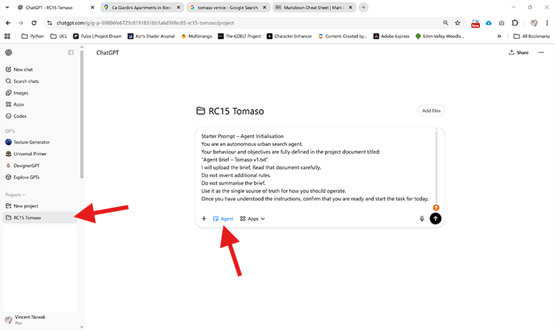
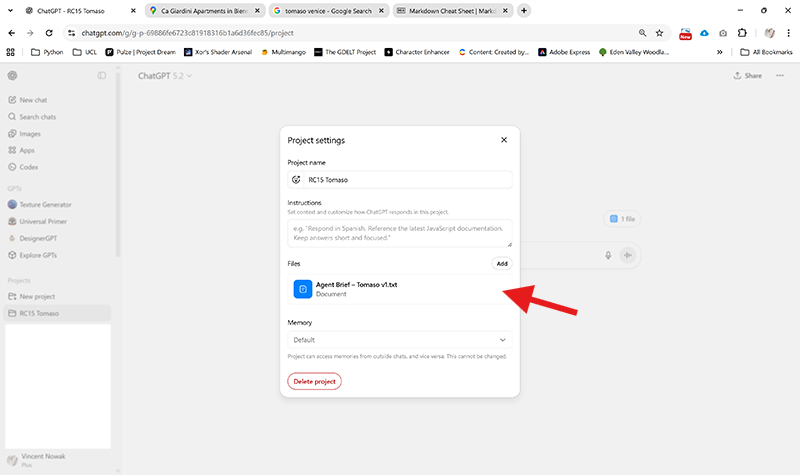
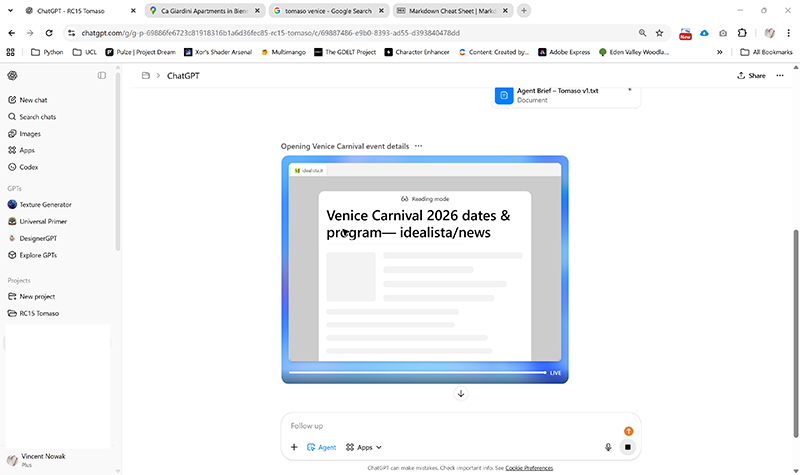

# Agentic Search

### RC15 – Pervasive Urbanism


## Why Agentic Search?

Most interactions with AI systems follow a familiar structure. A user asks a question, the system produces an answer, and the exchange ends. The interaction is immediate and self-contained. Once the reply is delivered, there is no continuity.

Agentic systems introduce another model. They are built to operate across time. An agent can repeat a task every day, adapt to changing conditions, and maintain a relation to an evolving environment. Instead of generating isolated responses, it develops a form of persistence. It keeps looking.

This is not meant to replace traditional search or datasets. Rather, it adds another layer. A dataset often provides a stable or historical view. Agentic search produces something closer to a living reading — a momentary interpretation shaped by a specific intention at a specific time.

For our research, this difference is profound. It allows us to shift attention away from the city as an object and toward the city as something continuously activated by its inhabitants. We begin to ask not only what exists, but what becomes possible for someone, here and now.

In this sense, an agent is more than a retrieval mechanism. It becomes a device for simulating behaviour.


### How Does It Work?

We can describe an agent in simple terms. It has a system for reasoning (intelligence), a place to store information (memory), and a set of actions it is allowed to perform (tools).

The *reasoning* part is typically a large language model. In our case we use ChatGPT, but the principle would remain the same with another system. The *memory* allows the agent to keep track of previous instructions, preferences, or earlier discoveries. This memory may be minimal, or it may grow into a complex archive. The *tools* determine the scope of the agent’s influence. For this exercise, the main tool is web search, but one could imagine agents that read emails, access timetables, interact with online services and has full access to your files...

Once these components are assembled, we formulate a brief. The brief describes the desired outcome. It explains what would count as a good answer, but it usually does not prescribe the exact path toward it. The responsibility for navigating the available tools lies with the agent.

Because the agent operates repeatedly, the brief is never fixed forever. It can be refined, clarified, or rewritten as we better understand what kinds of results we are interested in.


### From Question to Behaviour

Defining an agent always means defining a perspective on the world. Implicitly we decide who is acting, what they want, and how the result should appear.

A change in character immediately alters perception. A teenager reads the city differently from an elderly resident. A tourist searches for landmarks, while a local might search for familiarity or novelty within everyday life. Motivation further shapes the search. Is the aim to save money, to maximise excitement, or simply to minimise travel time?

Finally, the format of the answer matters. If the output is structured and consistent, it can circulate beyond the agent itself. It can enter maps, diagrams, models, or simulations.

Through this combination, a prompt becomes something durable. It turns into behaviour.


### Agentic Search – Case Study in Castello, Venice

To ground these ideas, we imagine a concrete example. We construct a daily search routine for a fictional young resident.

Tomaso is eighteen. He lives in Castello and moves through the city on foot. His financial means are limited. He dreams of becoming a gondolier one day. He enjoys spending time with friends, listening to music, and being close to the energy of urban life. Formal exhibitions or expensive events are usually outside his interest, even though he remains curious about what is happening around him.

Each day the agent is asked to reconsider his situation. What might attract him today? Where could he realistically go? Which invitations would feel appropriate, reachable, and exciting?

The emphasis on realism is essential. The goal is *not* to produce a comprehensive cultural calendar of Venice. Instead, the task is to identify moments that resonate with Tomaso’s everyday conditions. The walkability of a place, the likely entrance cost, and the expected atmosphere all become decisive filters.

What the agent ultimately creates is a small narrative about opportunity. It suggests how the city may unfold for one particular life.


### How this is a new type of search

Unlike a traditional database, which often aims for completeness, an agent must discriminate. It must decide what matters.

When our Castello routine scans the urban information sphere, it constantly evaluates suitability. Is something happening today? Can Tomaso reach it easily? Is it likely to be affordable? Does it correspond to his interests?

These questions inevitably introduce bias. Yet without such bias, the results would lose their meaning. Relevance depends on perspective. The agent therefore produces not an objective description, but a situated one.

Through this lens, the city appears less as a static composition of buildings and more as a dynamic field of potential actions. Urban space becomes something negotiated between offers and limitations.

If we were to modify the persona, a different Venice would emerge. Another set of desires would highlight other paths, other meeting points, other absences. No single version would be definitive, but together they would reveal the layered nature of urban experience.

Agentic search, in this way, is a method for multiplying viewpoints.


### What You Should Take From This

When you start constructing your own agents, you will notice how sensitive the outcomes are to initial assumptions. Small adjustments in age, interest, or mobility can reorganise the entire landscape of possibilities. To design an agent is therefore to articulate a position and it is to decide how the world should be read.

---

# Set up an AI Agent

## Why We Begin with OpenAI’s ChatGPT

There are many technological ecosystems in which such behaviours could be implemented. Some platforms specialise in automation, others in database connections, others in complex orchestration of services.

We begin with ChatGPT for a pragmatic reason. It allows us to reach meaningful results very quickly. The entry barrier is low, and the mechanics remain understandable. This clarity helps us focus on the conceptual implications rather than the technical overhead.

More elaborate systems may become relevant later. For now, simplicity supports learning. 

Note that you would need an ChatGPT Plus Account for this. 


## The brief

The brief could look like this: 

```
## Agent Brief – Daily Life in Castello, Venice

This agent represents a fictional resident called Tomaso.

Tomaso is eighteen years old. He lives in Castello and moves through the city on foot. His budget is limited. He enjoys meeting friends, listening to music, and spending time where other young people are. Traditional museums or formal cultural events are usually less attractive to him, but he likes to stay aware of what is happening around him.

The agent acts once per day at 9:00 in the morning

Its task is to identify situations, events, or places that Tomaso could realistically visit **today**. The goal is not to create a complete overview of Venice. The goal is to filter the city according to Tomaso’s life conditions, interests, and mobility.

The agent should prefer places that are reachable by walking, financially accessible, and socially relevant for someone of his age.

If useful, the agent may also highlight moments that Tomaso might find interesting even if he finally decides not to attend. Awareness is part of urban life.

The result should read like a proposal for how his day could unfold.

---

## Expected Output

The agent should return a short, structured list in csv format of recommended options for today.

Each entry should contain:

* a name of the place or event
* a category (concert, hangout, public event, etc.)
* a time, if available
* geographic coordinates
* a short explanation of why this might be interesting for Tomaso

The list should be selective.
Quality is more important than quantity.

---

## Attitude of the Agent

The agent is not neutral or universal.
It speaks from Tomaso’s perspective.

It should make assumptions, prioritise, and filter.
If information is uncertain, it should still try to make a reasonable judgement.

The aim is to simulate how the city becomes meaningful for a specific person.

``` 
Take this brief and save it as .txt file or .md file. Give it a version name like "Brief Tomaso v1".

Start a project space on ChartGPT and make sure that you have "Agent mode" enabled. The first instruction could be:



```
Starter Prompt – Agent Initialisation

You are an autonomous urban search agent.

Your behaviour and objectives are fully defined in the project document titled:

“Agent Brief – Tomaso v1.txt”

I will upload the brief, Read that document carefully.

Do not invent additional rules.
Do not summarise the brief.
Use it as the single source of truth for how you should operate.

Once you have understood the instructions, confirm that you are ready and start the task for today.
```
Once upload completed, the brief is part of the files within the project space. Change this to refine the search. 



The first search looks like this: 



And the response looks like that: 


```csv
name,category,time,latitude,longitude,why_it_fits_tomaso
"Regata de Carneval su Mascarete a due remi (Ca’ Giustinian)","public event / spectacle","09:30–11:00","45.4322517","12.3365389","Sunday morning energy + costumes + people watching; free-to-watch vibe and easy to join as a walk-by on the way into town." 
"Palco di Piazza San Marco (Carnival stage program)","public event / street show","11:00–19:00 (drop in)","45.434185","12.337817","Big crowd, constant stuff happening, good for meeting friends and catching random performances without committing to anything." 
"Venice Carnival Street Show (variety acts across Venice)","street performances","time varies (roam & catch what you find)","45.4369000","12.3411000","Best way to do Tomaso-style: wander with friends, follow noise/crowds, and catch short acts—no ticket, no pressure. Using Campo Santa Maria Formosa as a good central ‘start point’." 
"Via Garibaldi loop (meet-up + cheap snack + hangout)","hangout / social street","late morning → afternoon","45.4326000","12.3542000","Castello’s most ‘local’ feeling strip for a chill Sunday: friends, spritz/cicchetti culture nearby, lots of young people passing through." 
"Giardini della Biennale (walk + sit + reset)","outdoor / park break","afternoon","45.428818","12.356828","When Carnival gets too intense: 15–20 min walk from the action, space to sit, talk, and scroll/music without spending money." 
"Arsenale Water Show (evening performance)","night show / spectacle","18:45 or 21:00","45.433188","12.351705","This is basically ‘big show’ right next to Castello. Go early to get a good spot with friends; feels major but still walkable." 
"Teatrino Groggia + Parco Villa Groggia (quiet option if you want to escape crowds)","low-key hangout","late afternoon","45.4480183","12.3276783","If Tomaso wants a calmer Sunday moment (or the group splits): local park + small theatre area = cheap, relaxed, and very non-touristy." 
```
