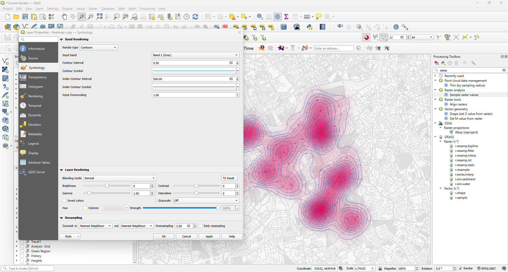
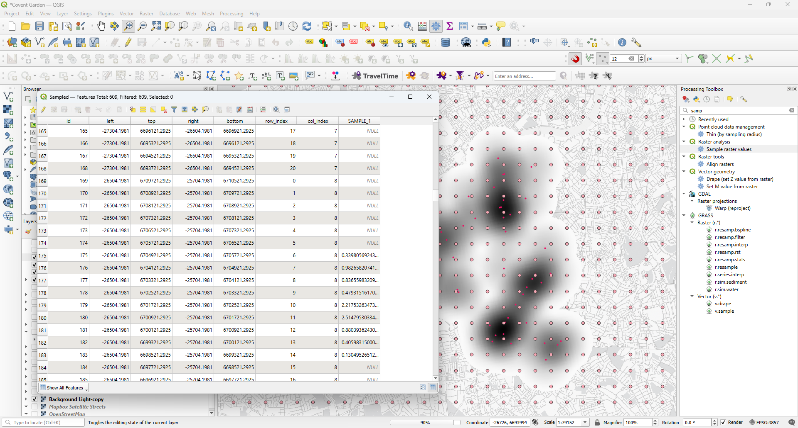
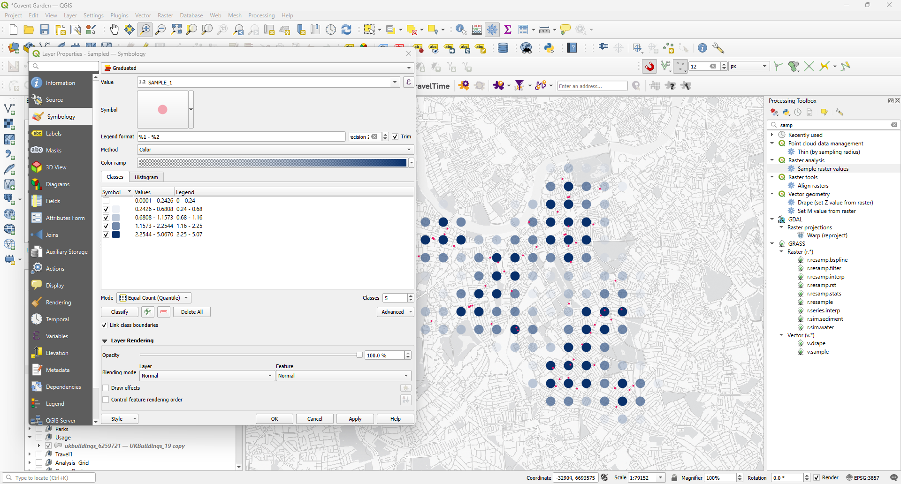
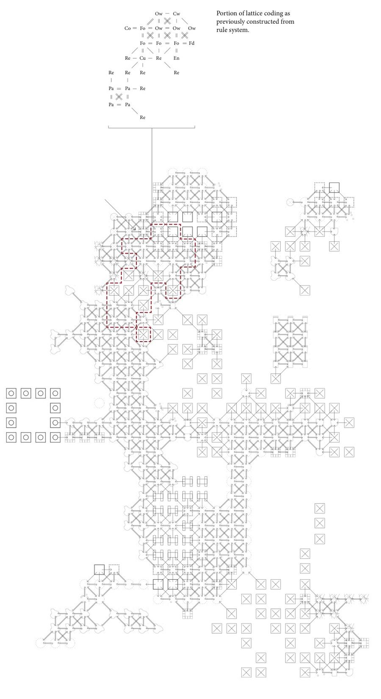
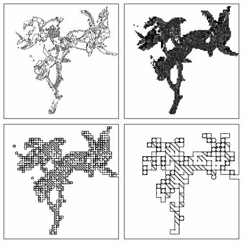
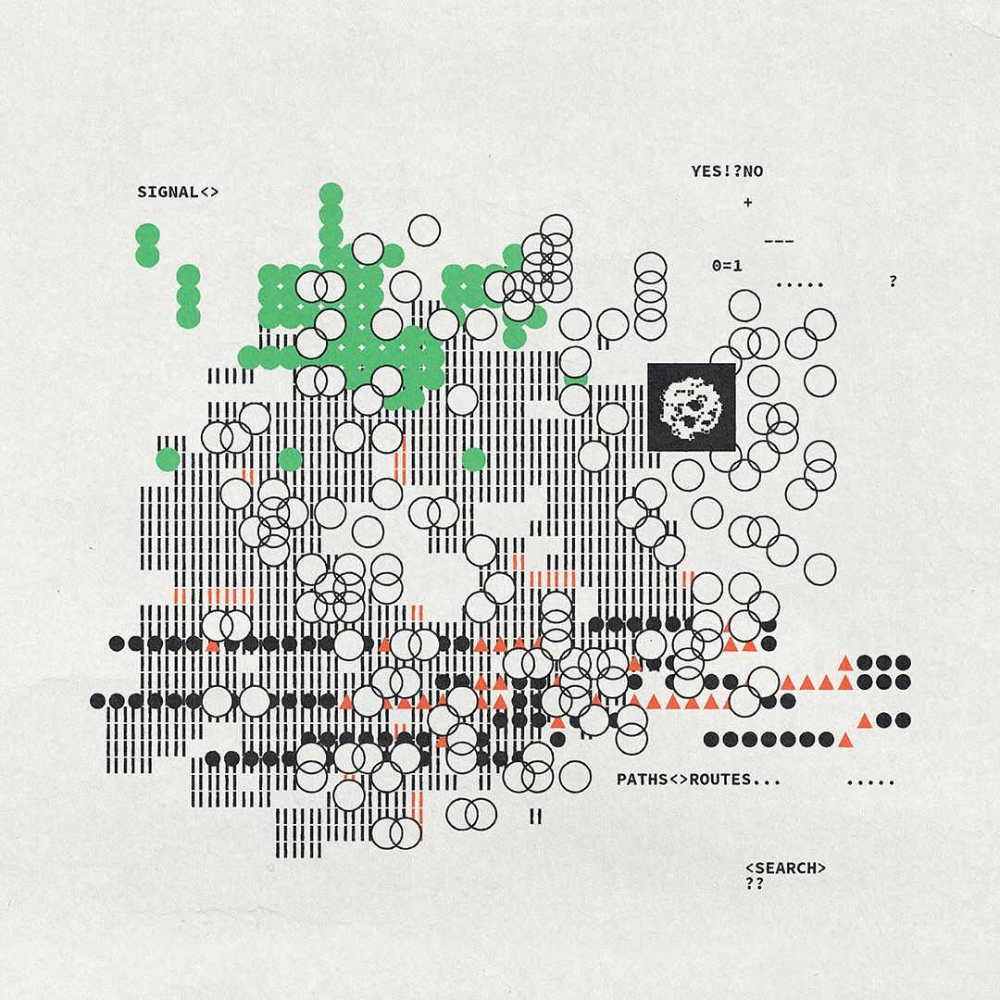
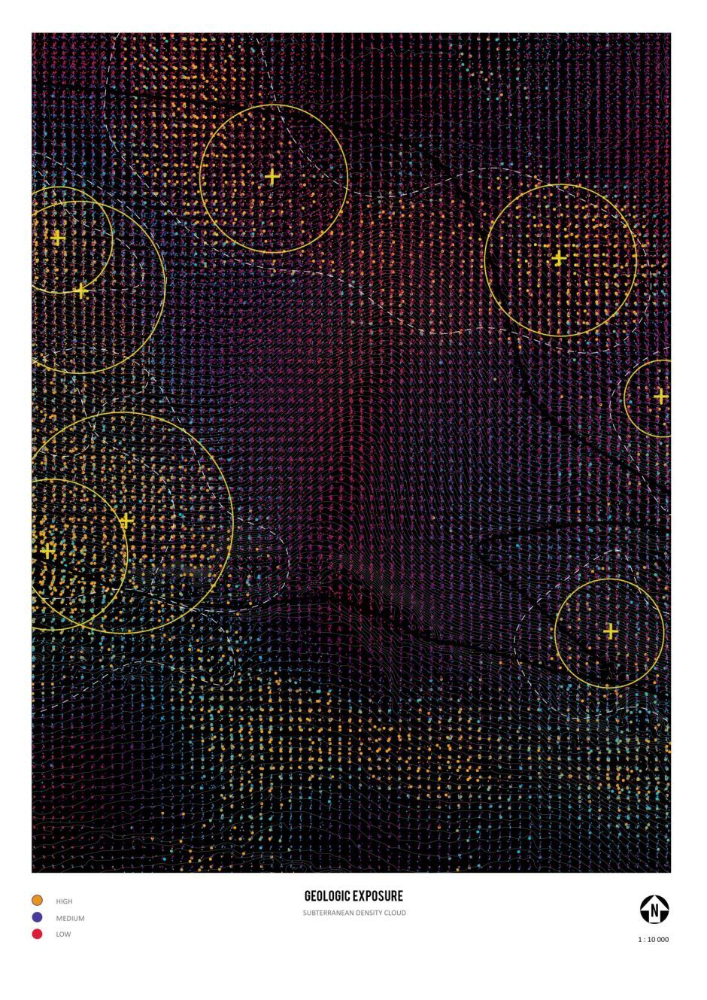

# Heatmaps in QGIS

## Creating Density Maps from Point Data

This tutorial explains how to create and refine heatmaps in QGIS. Heatmaps are useful for visualising spatial density, but the default output is not always suitable for presentation graphics. The techniques below show how to improve clarity and visual quality.

## What is a Heatmap?

In QGIS, heatmaps visualise the density or intensity of spatial data by creating a continuous surface from individual point locations. Each point contributes influence to the surrounding area, represented as a gradient that fades with distance.

### Two Methods for Creating Heatmaps

There are two main ways to generate heatmaps in QGIS:

| Method | Location | Characteristics |
|--------|----------|-----------------|
| **Processing Toolbox** | `Processing Toolbox → Interpolation → Heatmap` | Creates a static raster layer that can be saved and reused |
| **Layer Style** | `Layer Properties → Symbology → Heatmap` | Dynamic, but recalculates on every view change (slower with large datasets) |

> **Note:** This tutorial uses the Processing Toolbox method because it is more stable and efficient when preparing graphics.

## Example: Mapping Pharmacy Density

In this example, we visualise the density of pharmacies in South East London using a point layer of pharmacy locations.

### Key Parameters

Before generating the heatmap, understand these two critical settings:

- **Radius** – Defines how far the influence of each point spreads. A larger radius produces smoother, more generalised results; a smaller radius highlights local clusters.
- **Resolution** – Determines the size of the raster cells. Higher resolution creates more detail but increases processing time and file size.

### Step-by-Step: Creating the Heatmap

1. Open the **Processing Toolbox** (`Processing → Toolbox` or press `Ctrl+Alt+T`)
2. Search for **Heatmap** and select `Interpolation → Heatmap (Kernel Density Estimation)`
3. Configure the settings:
   - **Input layer:** Select your point layer (e.g., pharmacies)
   - **Radius:** Set an appropriate search radius (e.g., 1000 m)
   - **Pixel size X/Y:** Set the resolution (e.g., 10 × 10 px for testing)
   - **Output raster:** Choose a filename and location
4. Click **Run**

The result is a raster layer showing density values across the study area:

> **Tip:** Start with a lower resolution (larger pixel size) for testing. Increase resolution for finer graphics.

## Improving the Graphics

Once the heatmap is created, there are several ways to improve its visual quality for presentation.

### 1. Editing the Colour Gradient

The simplest improvement is to adjust the colour gradient.

**Steps:**

1. Right-click the heatmap layer and select **Properties**
2. Go to the **Symbology** tab
3. Select **Singleband pseudocolor** as the render type
4. Choose or customise a colour ramp
5. Adjust the **Min/Max** values and **Mode** (e.g., Equal Interval, Quantile)
6. Set transparency for low values to hide areas with minimal density
7. Click **Apply** to preview, then **OK**

**Styling tips:**

- Often you see a sequential colour ramp (e.g., white → yellow → red) for density. And often it looks too much. 
- Set the minimum value slightly above zero to create transparency in low-density areas
- Experiment with blending modes. 

### 2. Adding Contours

Contours show lines of equal density and help clarify spatial structure.

**Steps:**

1. Open the **Processing Toolbox**
2. Search for **Contour** and select `Raster extraction → Contour`
3. Configure the settings:
   - **Input layer:** Select your heatmap raster
   - **Interval between contour lines:** Set a value (e.g., 0.0001 depending on your data range)
   - **Output:** Choose a filename
4. Click **Run**

The resulting vector layer can be styled independently:

- Adjust line weight and colour
- Label contour values
- Use different line styles for major/minor intervals

> **Tip:** The Processing Toolbox (`Ctrl+Alt+T`) provides access to all analytical tools including raster extraction, interpolation, and contour generation.

> **Tip:** You can reach the same effect as layer style

### 3. Discrete Sample Points

Instead of relying on the continuous raster surface, sampling values at regular grid points allows more flexible styling and cleaner graphics for publications.

#### Step 1 – Create a Grid

1. Open the **Processing Toolbox**
2. Search for **Create Grid** and select `Vector creation → Create Grid`
3. Configure the settings:
   - **Grid type:** Point
   - **Grid extent:** Match your study area or use layer extent
   - **Horizontal/Vertical spacing:** Set the point interval (e.g., 150 m)
4. Click **Run**

The result is a regular grid of points:

#### Step 2 – Extract Raster Values

1. Open the **Processing Toolbox**
2. Search for **Sample Raster Values** and select `Raster analysis → Sample Raster Values`
3. Configure the settings:
   - **Input layer:** Your grid points
   - **Raster layer:** Your heatmap raster
   - **Output column prefix:** Name for the value column (e.g., "density")
4. Click **Run**

Each point now contains the heatmap value at that location:

#### Step 3 – Style the Points

With values attached to each point, you can create various visualisations:

- **Proportional symbols** – Size points by density value
- **Colour classes** – Categorise points by density ranges
- **Dot density maps** – Filter to show only high-value points

For rule-based styling with multiple conditions:

---

## Beyond Standard Cartography

At this point, you can see where this is heading. The next steps would involve exploring different geometries, possibly overlapping different symbols so that they form new patterns. QGIS extends this further by offering the use of .svg symbols—custom graphics that you can create in Illustrator and bring into QGIS. From here, there is quite a lot of ground to explore.

By leaving off-the-shelf visualisation behind, we move beyond conventional map representation into more sophisticated territory, exploring different, more artistic types of graphics.

Here are a few examples:

