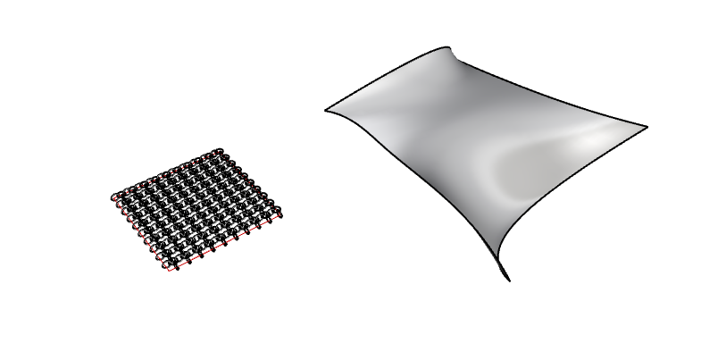
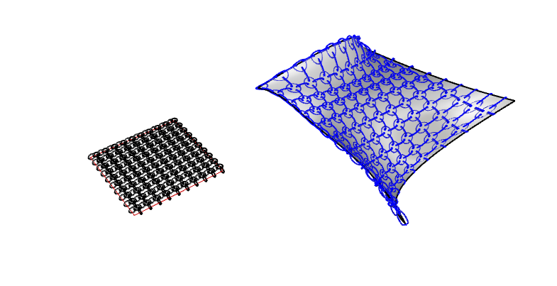
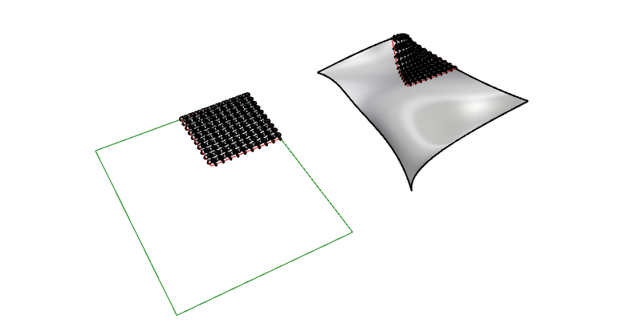
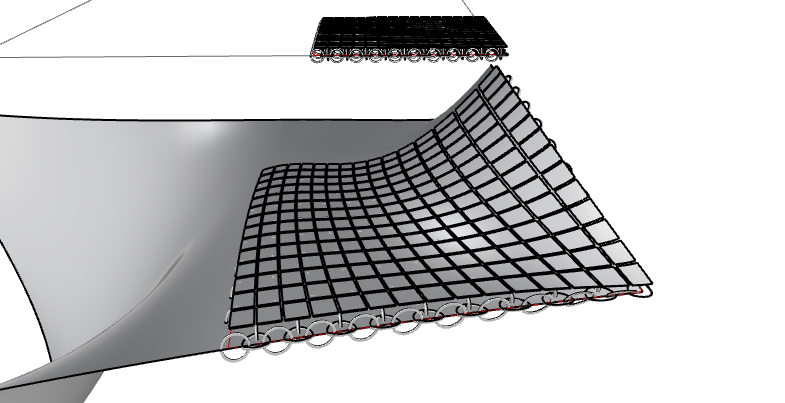

# Flow Along Surface in Rhino
### A Practical Guide to Morphing Geometry onto 3D Surfaces


## Overview

One of the most powerful yet underused commands in Rhino is **FlowAlongSrf**. It allows you to take geometry drawn on a flat, rectilinear plane and morph it seamlessly onto any freeform 3D surface — preserving the precision of your 2D drafting while adapting it to complex curvature.

This approach bridges the gap between the simplicity of 2D drawing and the complexity of 3D surface geometry. Rather than struggling to model intricate patterns directly in 3D, you can work flat, think precisely, and let Rhino handle the transformation.

This tutorial walks through a practical workflow using **FlowAlongSrf** together with **CreateUVCrv** to create textile-like surface geometry with full control over scaling and proportion.


## The Core Idea

Think of it like wrapping a printed sheet of paper around an object. You design your pattern flat, then the surface acts as the mould. The key insight is that Rhino maintains the *relationships* between your source geometry and the target surface — so what you draw in 2D maps accurately onto the 3D form.


## Step 1 — Setting Up the Source Geometry

Start by drawing your source geometry on a flat plane in a straightforward, rectilinear arrangement. In this example, the source geometry is an interlocking array of circles, arranged as a simple repeating textile-like pattern.

> **Tip:** At this stage, don't worry about exact sizing relative to your target surface. We'll address scaling precisely in the next section.



*The target surface is shown on the right; the flat source geometry on the left. Note the red boundary line drawn around the geometry — this will serve as the base reference when running the command.*


## Step 2 — Running FlowAlongSrf

With your source geometry ready, run the command:

```
FlowAlongSrf
```

The command will prompt you to:

1. **Select the source objects** — pick your flat geometry
2. **Select the base surface** — choose "Plane" and pick the flat reference plane your geometry sits on
3. **Select the target surface** — pick the 3D surface you want to morph onto

There are additional options worth noting. Setting **Rigid = No** allows the geometry to deform freely with the surface curvature, which is generally what you want for organic or textile patterns. Setting **Rigid = Yes** preserves the shape more strictly, useful for structural elements.



*The circles have been morphed onto the target surface, following its curvature.*

This initial result is already compelling — but you may notice the geometry looks stretched or incorrectly scaled. This is because Rhino is mapping your flat geometry to the full extent of the target surface. To gain precise control, we need to use **CreateUVCrv**.


## Step 3 — Precise Control with CreateUVCrv

The command **CreateUVCrv** is the key to unlocking precise, predictable results with **FlowAlongSrf**.

```
CreateUVCrv
```

This command takes your 3D target surface and "unfolds" it — generating a flat 2D rectangle that represents the surface's UV space. Crucially, this establishes a direct geometric relationship between the flat 2D domain and the 3D surface. Every point in the flat rectangle corresponds to an exact point on the 3D surface.

Once you have this UV curve, you can:

- Draw your source geometry **at exactly the right size** within the UV rectangle
- Use the UV rectangle's boundary as the **base surface** in **FlowAlongSrf**, instead of a generic plane
- Guarantee that your pattern scales and positions correctly onto the 3D target



*The UV curve (flat rectangle) gives you an accurate 2D canvas scaled to match the 3D surface. Draw your pattern to fit this rectangle and it will morph onto the surface with correct proportions.*

This eliminates the guesswork entirely. Instead of stretching and hoping, you know exactly how your 2D geometry will land on the surface.


## Step 4 — Closed Geometry and 3D Printing

One of the elegant properties of this workflow is that **closed geometry stays closed** through the transformation. If you start with closed curves or closed polysurfaces in your source geometry, the morphed result will also be closed.



*More complex interlocking geometry, morphed onto the surface. Because the source was closed, the result is also closed — ready for 3D printing or fabrication.*

This makes the workflow directly applicable to digital fabrication. You can design intricate, surface-adapted geometries in 2D and output them as 3D-printable geometry with minimal extra steps.


## Related Commands

These commands form a powerful family that work well together:

| Command | Purpose |
|---|---|
| `FlowAlongSrf` | Morph objects from a flat plane onto a target surface |
| `CreateUVCrv` | Unfold a 3D surface into a flat 2D rectangle for use as a reference plane |
| `Flow` | Morph objects along a curve (1D version of FlowAlongSrf) |
| `ApplyCrv` | Map linework directly onto a surface using UV coordinates |


## Why This Workflow Matters

The combination of **FlowAlongSrf** and **CreateUVCrv** is particularly valuable because it gives you both **freeform flexibility and dimensional precision** — two things that are hard to achieve simultaneously in 3D modelling.

Some practical applications:

- **Textile and surface patterns** — as shown in this tutorial
- **Curved staircases** — use `Flow` to wrap a stair profile along a curved path
- **Facade mullion layouts** — design a regular grid in 2D and morph it onto a doubly-curved facade
- **Panelisation** — create panel patterns that adapt to surface curvature while maintaining consistent dimensions

These workflows are especially appealing compared to the alternative: setting up a Grasshopper definition. Grasshopper gives you more parametric control, but the setup cost is high. For many tasks — particularly early design exploration — **FlowAlongSrf** and **CreateUVCrv** give you 80% of the result in a fraction of the time.


## History and Live Adjustments

An often-overlooked advantage of these commands is that they are **history-enabled** in Rhino. This means that after running **FlowAlongSrf**, if you modify your source geometry, the morphed result updates automatically.

This enables a workflow where you:

1. Set up the FlowAlongSrf relationship once
2. Continue refining your source 2D geometry
3. See the 3D result update in real time

It's not quite Grasshopper-level parametric control, but it's remarkably effective — and far quicker to set up.

---

## Further Reading

- [FlowAlongSrf — Official Rhino Documentation](https://docs.mcneel.com/rhino/mac/help/en-us/commands/flowalongsrf.htm)
- Also search the Rhino documentation for `CreateUVCrv`, `Flow`, and `ApplyCrv` for the full picture of this command family.