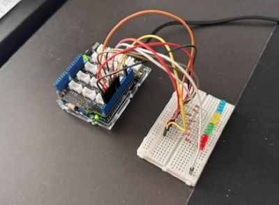
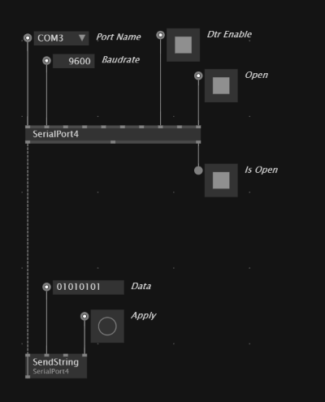
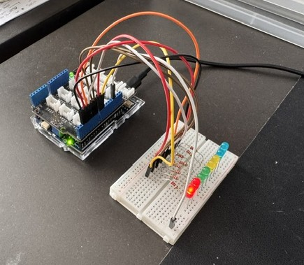
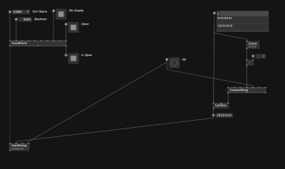
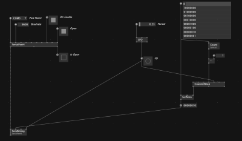
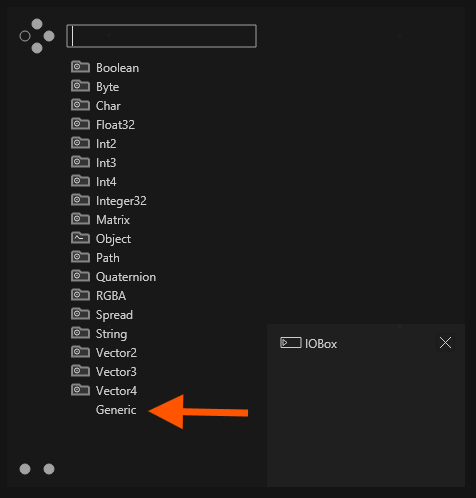
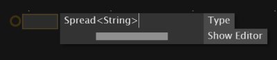
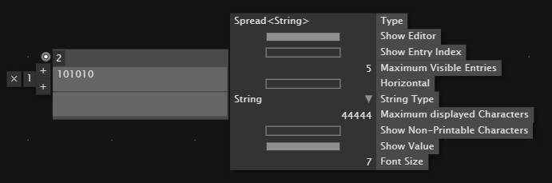
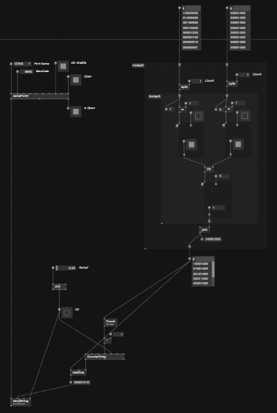

# Controlling a Series of LEDs with vvvv and Arduino

## Introduction

This tutorial explains how to control a series of LEDs directly from vvvv. We will work with a row of 8 LEDs and explore how to control each LED individually, as well as how to program sequences and patterns.

This method is intentionally simple and abstract. It can be scaled (to a certain degree) and extended to control other devices such as servos, motors, or relays.



### Firmata vs Serial Communication

There are multiple ways to control an Arduino from a computer. One common approach is to use **Firmata**, which allows direct control of Arduino pins from software such as Python, Grasshopper (Python), or vvvv.

In this setup, the Arduino acts mainly as a relay, while the logic runs on the computer. However, in practice this approach can be less robust. Each board requires a specific Firmata setup, and initial tests showed inconsistent and unreliable behaviour.

Therefore, this tutorial describes an alternative workflow that is more robust: a string is sent to the Arduino via serial communication, where the code interprets the string and executes a command.

This approach is robust because the Arduino only receives a simple string. This string can be sent from any software, including vvvv or Grasshopper.

In this tutorial, we use vvvv because it provides a clear and flexible interface for generating and sending control data.

### Core Concept

The system is based on sending an 8-character string to the Arduino. Each character represents the ON/OFF state of one LED.

Examples:

* `00000000` → all LEDs OFF
* `11111111` → all LEDs ON
* `10000000` → only the first LED ON

This simple encoding allows full control over the LED array and forms the basis for more complex behaviours.


## Arduino

The hardware setup is simple: each digital pin drives one LED. Pins 0 and 1 should not be used, as they may interfere with serial communication.

### Wiring

| LED | Arduino Pin |
| --- | ----------- |
| 1   | D2          |
| 2   | D3          |
| 3   | D4          |
| 4   | D5          |
| 5   | D6          |
| 6   | D7          |
| 7   | D8          |
| 8   | D9          |

All LED cathodes are connected to GND.


### Arduino Code

The Arduino reads a string from serial and switches LEDs accordingly.

```cpp
const int ledPins[8] = {2,3,4,5,6,7,8,9};
String inputString = "";

void setup() {
  Serial.begin(9600);
  for(int i=0; i<8; i++) {
    pinMode(ledPins[i], OUTPUT);
  }
}

void loop() {
  if (Serial.available()) {
    inputString = Serial.readStringUntil('\n');

    for(int i=0; i<8; i++) {
      if(inputString[i] == '1') {
        digitalWrite(ledPins[i], HIGH);
      } else {
        digitalWrite(ledPins[i], LOW);
      }
    }
  }
}
```


## VVVV

We send an 8-character string from vvvv:

```
10100001
```

Each character corresponds to one LED:

* `1` → ON
* `0` → OFF

---

### vvvv Setup

In it's core, the setup in vvvv is as simple as the screenhsot below: 

File: *01 Serial Communication.vl*



The **SerialPort4** node establishes communication with the Arduino. It allows you to send and receive data such as strings or floats. In this case, we are communicating using strings. Press apply to send over the commad. 

The image below is the command ```10000000```




#### Play sequences

File: *02 Serial Communication.vl*



This is an extension of the previous setup that allows you to play animations or sequences. On the right-hand side of the patch, a list of strings defines different LED states. A counter generates an index, and based on this index, the corresponding string is selected and sent to the Arduino.

Press "Up" to step through the sequence manually.

The image below shows an LFO node that advances the sequence automatically.

File: *03 Serial Communication.vl*



#### **Creating Spreads**
It may not be immediately clear how to create spreads of strings, as shown in the screenshot above. The following steps explain the process.

First, create a generic IOBox:




Right-click on the IOBox, select Configure, and set the type to String:




Then continue configuring the IOBox:

* Enable Max Visible Entries
* Enable Show Values
* Adjust the number of entries either in the configuration or directly in the top-left corner of the IOBox




This is generally all you need to play simple LED animations. 

--- 

### EXTRA: Combining Strings in vvvv

File: *04 Serial Communication.vl*



This allows layering of control logic.

This example patch shows how to combine different animation sequences. For example, one LED can move across the array while another remains fixed. Both sequences can be merged into a single output.

Example:
```
10000000
00000001
```
Combines to
```
10000001
```

While the same animation could be written directly as one sequence, that is not the point here. The focus is on building more complex behaviours from simple base patterns.

The combined logic can then be encapsulated into a process node. This allows you to chain multiple patterns together, switch between base patterns, or build increasingly complex animations in a modular way.
