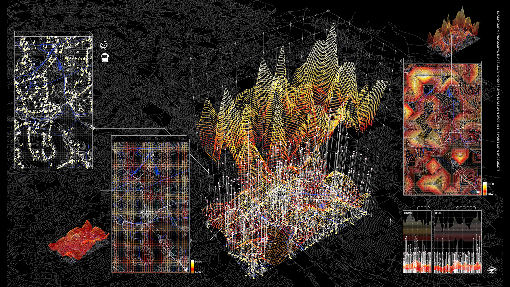

# Skills Module Pervasive Urbanism 2025-26

# Dates
| Nr   |           Date|       Module|                  Topic|    Time|      Location|
|-----:|---------------| ------------|-----------------------|--------|--------------|
|     1|               |             |                       |        |              |
|     2|               |             |                       |        |              |
|     3|               |             |                       |        |              |
|     4|               |             |                       |        |              |
|     5|               |             |                       |        |              |
|     6|               |             |                       |        |              |
|     7|               |             |                       |        |              |
|     8|               |             |                       |        |              |
|     9|               |             |                       |        |              |

# SKILLS MODULES

## Skills Module 1: Prosthetic Clouds

This module focuses on designing a **wearable prototype** that acts as a prosthetic interface between your body and the urban environment. Using **microcontrollers and Arduino**, you will create sensors and actuators that respond to, and influence, your perception of the city.

Through **GPS integration**, the devices will be able to track time and location, while events can be **logged or transmitted** directly to a computer. You will also learn how to **visualize and represent the recorded data** within **Rhino/Grasshopper**.

In addition, we will explore techniques for the **physical design and fabrication** of your prototype — including **laser cutting**, **3D printing**, and **PCB design**.
  

## Skills Module 2: Cartographies of Affect

In this module, we will explore **desktop-based data-mining techniques**, starting with publicly available sources such as the **London Datastore**, and learn how to **process and visualize different data formats**.

You will also learn how to **extract and analyse data** from platforms like **Flickr** or **Google**, transforming digital traces into spatial insight. We will apply **text- and image-based sentiment analysis**, as well as introduce **machine-learning methods for object recognition** on the collected datasets.

All tasks will be carried out using a combination of **Python**, **Rhino/Grasshopper**, and **Adobe Illustrator**.

## Skills Module 3: Affective Cinematics

This module investigates techniques of **visual communication** and **narrative construction**, focusing on the production of **short films as design outcomes**. You will learn how to transform spatial and data-driven material into **storyboards, sequences, and edited films** that communicate ideas through emotion and rhythm.

We will explore methods for **composing still and moving images**, integrating **3D model outputs**, **graphic overlays**, and **sound** into coherent visual narratives.

Through **hands-on tutorials in video editing software**, you will develop skills in **framing, pacing, transitions**, and the **layering of text, sound, and voiceover**. The emphasis is on **storytelling as a design tool** — constructing affective atmospheres, articulating complex ideas, and engaging diverse audiences through cinematic expression.

# SUPPORT & RESOURCES

## GitHub

We use a  **GitHub repository** to store and share sample code, links, and materials related to the skills modules.
This will serve as your **central access point** for all tutorial resources.

The page will be updated regularly — please check it frequently.
You can **fork the repository** to your computer and **sync updates** when needed.

If you’re new to GitHub, we recommend installing [GitHub Desktop](https://desktop.github.com/) and reviewing the [getting started guide](https://docs.github.com/en/desktop/overview/getting-started-with-github-desktop).

## Inductions at B-Made

[B-Made](https://www.ucl.ac.uk/bartlett/about/our-locations-and-facilities/b-made-bartlett-workshops) offers access to **laser cutters, 3D printers, and model-making tools**.
To use these facilities, complete the required [induction](https://moodle.ucl.ac.uk/course/view.php?id=39723&section=1#tabs-tree-start).

Refer to the [B-Made Moodle page](https://moodle.ucl.ac.uk/course/view.php?id=39723&section=0#tabs-tree-start) for details on **file preparation** and workshop protocols.

B-Made also provides **equipment rentals**, such as **3D scanners and cameras**, which require a separate [induction](https://moodle.ucl.ac.uk/course/view.php?id=39723&section=46#tabs-tree-start) before use.

## Resources
Alongside this page, you’ll find an additional page with further [resources](Resources.md).

## YouTube
Recordings of the skills tutorials are available on YouTube, usually a few days after each session:
🎥 [YouTube Channel — Skills 2025/26](https://www.youtube.com/playlist?list=PL0TJgiFZ0aRLwPoAfxv-mIsKGgSE3zlBg)

These videos are **unlisted** — they won’t appear in searches and can only be accessed through the links provided.

You can also explore recordings from previous years for extended material on **QGIS**, **data mining**, and **vvvv**, though these are **not part of the current curriculum**:

* [Skills 2024/25](https://www.youtube.com/playlist?list=PL0TJgiFZ0aRLwPoAfxv-mIsKGgSE3zlBg)
* [Skills 2023/24](https://www.youtube.com/playlist?list=PL0TJgiFZ0aRLx7_uol3rhIsS53ecXHYlr)
