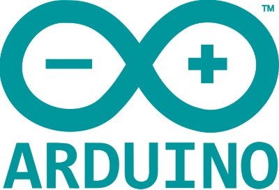
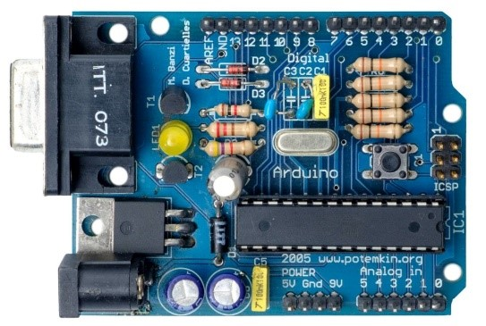
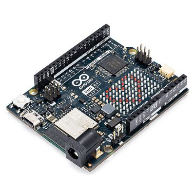
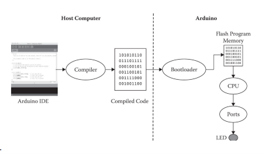
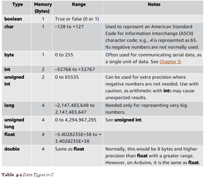

# Introduction to Arduino


## What is Arduino, where does it come from?
Arduino is an open-source electronics platform that allows users to program microcontrollers. It was developed in 2003 at the Interaction Design Institute Ivrea (IDII) in Ivrea, Italy by Massimo Banzi. From the outset, it has been developed as an open-source language that allows easy programming of low-cost microprocessors. This proved to be remarkably successful, and Arduino managed to establish itself as one of the main languages to program microprocessors and for easy prototyping.


Above the bar “Arduino” in Ivrea where the founders used to hang out. 



The image on the top shows the first Arduino. 

You can visit the webpage here:  **[Arduino Website](https://www.arduino.cc/)**

## What can it do and what not?
Arduino enables the creation of prototypes for microprocessors, allowing the development of various devices such as sensors, robots, and smart IoT devices. However, Arduino is different from computers like the Raspberry Pi. While it is short on processing power and has no operating system, it is more energy-efficient, compact, and easier to deal with (and also cheaper!).

Ardunio has open the world of microprocessoprs to the wider public:

1. Arduino programming is not geared toward professional production. It employs a simplified language designed for prototyping. Imagine this this language as an *extra layer* that sits between you and the microprocessor.  
2. Most, but not every microprocessor can be programmed using Arduino. The *extra layer* must exist and has to be intalled separatly.
3. The break though is that, the same -simplified- script can work on different microprocessors (with minor adaptations!).


## Language

The Arduino project consists of two parts: the language and the hardware. Both are linked together, as the language can only work on hardware that "knows" Arduino. The language is based on the **C Language**, a low-level language with a few simplifications.

The programming environment is called **Arduino IDE**. It translates the code into the specific language of the microprocessor, making Arduino accessible and successful.

> [!NOTE]
> For each new microprocessor, you need to configure the IDE accordingly. If it's not already available, you will need to download and install the correct configuration.


## The Ecosytem

Arduino is an open-source project. This transparency means anyone can use it without restrictions. Many companies now produce Arduino-compatible boards. Here are a few examples:

- [Adafruit](https://www.adafruit.com/)
- [SparkFun](https://www.sparkfun.com/)
- [Seeed Studio](https://www.seeedstudio.com/)

You can find various types on Amazon or eBay. It's advisable to choose well-known brands for better documentation.


---
# Our Board

There are many types of boards available, each suited to different projects. The Arduino **Uno R4 Wifi** is a felxible entry-level board suitable for a wide range of applications. 



- [Arduino Uno R4 Wifi Documentation](https://docs.arduino.cc/hardware/uno-r4-wifi/)

---

# Coding in Arduino (C Language)

**000 - Anatomy**
The typical arduino sketch follows this sequence. 

- Libraries
- Declare variables
- `Void setup()`
- `Void loop()`
- Functions

Refer to the [Arduino Reference Page](https://www.arduino.cc/reference/en/) for more information.

Arduino compiles the code in the IDE as follows:



---

### 001 - Basic LED Blink Sketch

Anatomy of a sketch, basic intro, commands, setup, and loop:

```cpp
void setup() {
  pinMode(LED_BUILTIN, OUTPUT);
}

void loop() {
  digitalWrite(LED_BUILTIN, HIGH);
  delay(1000);
  digitalWrite(LED_BUILTIN, LOW);
  delay(1000);
}
```

---

### 002 - Basic LED Blink Sketch with Variable and Feedback over the Serial Monitor

Introduction of a variable and output over the serial monitor. We’ll declare our first variable, and it’s worth looking at typical datatypes in C.

1 byte is 8 bits (00000001)

- 1 is `00000001`
- 2 is `00000010`
- ...
- 256 is `11111111` (the largest possible value in byte)

The Arduino Rev 4 Wifi has different types of memory:

- **EEPROM:** 8 KB (permanent memory)
- **RAM:** 32 KB (temporary data or runtime data such as variables)
- **FLASH:** 256 KB (where the code is saved)

Common datatypes include `boolean`, `char`, `int`, and `float`.



```cpp
int pause = 50;

void setup() {
  Serial.begin(9600);
  pinMode(LED_BUILTIN, OUTPUT);
}

void loop() {
  digitalWrite(LED_BUILTIN, HIGH);
  delay(pause);
  digitalWrite(LED_BUILTIN, LOW);
  delay(pause);
  Serial.print("The delay is: "); 
  Serial.print(pause);
  Serial.println("ms");
}
```

---

### 003 - Blink Sketch with a Function

Introduction of a simple function to keep the code organized, shorter, and modular:

```cpp
void setup() {
  Serial.begin(9600);
  pinMode(LED_BUILTIN, OUTPUT);
}

void loop() {
  flash(50, LED_BUILTIN);
  flash(500, LED_BUILTIN);
}

void flash(int pause, int ledNumber) {
  digitalWrite(ledNumber, HIGH);
  delay(pause);
  digitalWrite(ledNumber, LOW);
  delay(pause);
  Serial.print("The delay is: "); 
  Serial.print(pause);
  Serial.println("ms");
}
```

---

### 004 - Control Structure with “if”

An `if` control structure with a simple conditional statement:

```cpp
bool Fast = false;

void setup() {
  Serial.begin(9600);
  pinMode(LED_BUILTIN, OUTPUT);
}

void loop() {
  if (Fast == true) {
    flash(50, LED_BUILTIN);
  } else {
    flash(400, LED_BUILTIN);
  }
}

void flash(int period, int led) {
  digitalWrite(led, HIGH);
  delay(period);
  digitalWrite(led, LOW);
  delay(period);
  Serial.print("The delay is: ");
  Serial.println(period);
}
```

---

### 005 - Iterations with the "for" Loop

A simple **for** loop example:

```cpp
void setup() {
  Serial.begin(9600);
  pinMode(LED_BUILTIN, OUTPUT);
}

void loop() {
  for (int i = 0; i < 10; i = i + 1) {
    Serial.print("Loop Nr.");
    Serial.print(i);
    Serial.print("\t");
    flash(20, LED_BUILTIN);
  }
}

void flash(int period, int led) {
  digitalWrite(led, HIGH);
  delay(period);
  digitalWrite(led, LOW);
  delay(period);
  Serial.print("The delay is: ");
  Serial.println(period);
}
```

---

### 006 - For Loop with Array

Demonstrating array syntax and how to call a number from an array:

```cpp
int timedelay[] = {200, 40, 50, 500, 70};

void setup() {
  Serial.begin(9600);
  pinMode(LED_BUILTIN, OUTPUT);
}

void loop() {
  for (int i = 0; i < 5; i = i + 1) {
    Serial.print("Loop Nr.");
    Serial.print(i);
    Serial.print("\t");
    Serial.print("Number from array: ");
    Serial.print(timedelay[i]);
    Serial.print("\t");
    flash(timedelay[i], LED_BUILTIN);
  }
}

void flash(int period, int led) {
  digitalWrite(led, HIGH);
  delay(period);
  digitalWrite(led, LOW);
  delay(period);
  Serial.print("The delay is: ");
  Serial.println(period);
}
```

---

### 007 - Communication via the Serial Monitor

Example showing how to control an LED via the serial monitor:

```cpp
void setup() {
  pinMode(LED_BUILTIN, OUTPUT);
  digitalWrite(LED_BUILTIN, LOW);
  Serial.begin(9600);
}

void loop() {
  if (Serial.available() > 0) {
    char letter = Serial.read();
    if (letter == '1') {
      digitalWrite(LED_BUILTIN, HIGH);
      Serial.println("LED is on!");
    }
    else if (letter == '0') {
      digitalWrite(LED_BUILTIN, LOW);
      Serial.println("LED is OFF!");
    }
  }
}
```


---

### 008 - Messages in the Serial Interface

Sending and receiving messages via the serial monitor:

```cpp
void setup() {
  Serial.begin(9600);
}

void loop() {
  String message = "";
  if (Serial.available() > 0) {
    while (Serial.available() > 0) {
      message = message + char(Serial.read());
      delay(250);
    }
    Serial.println(message);
  }
}
```

---


