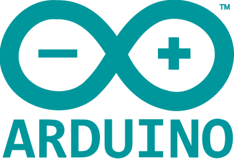
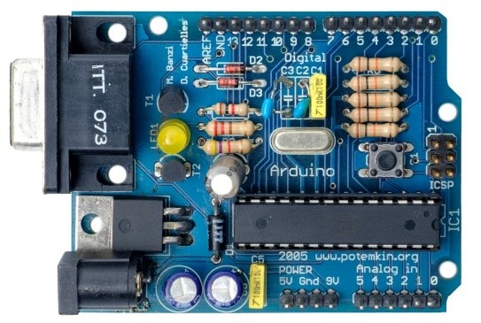
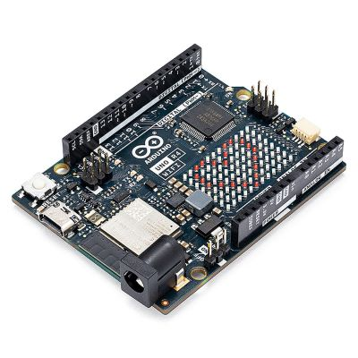
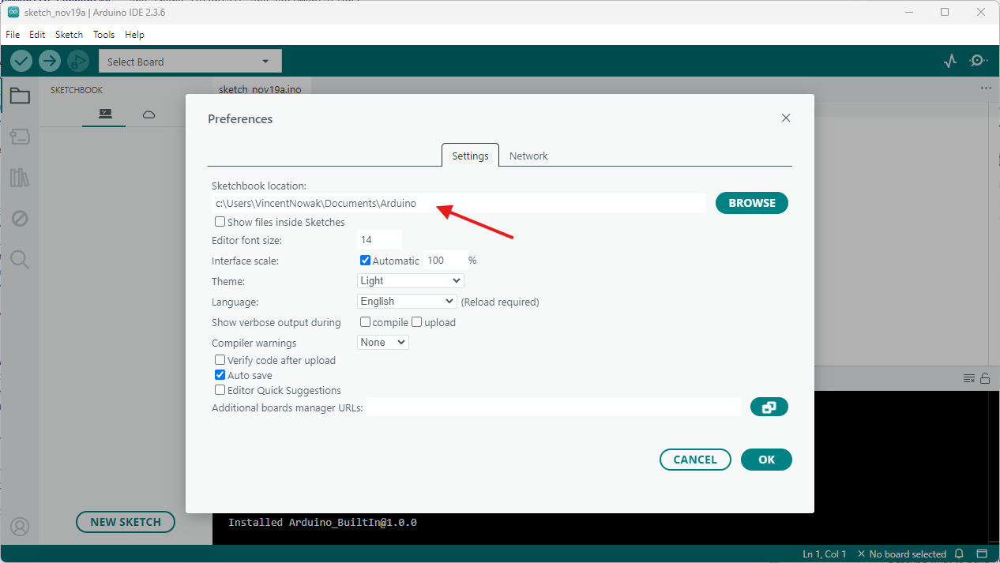
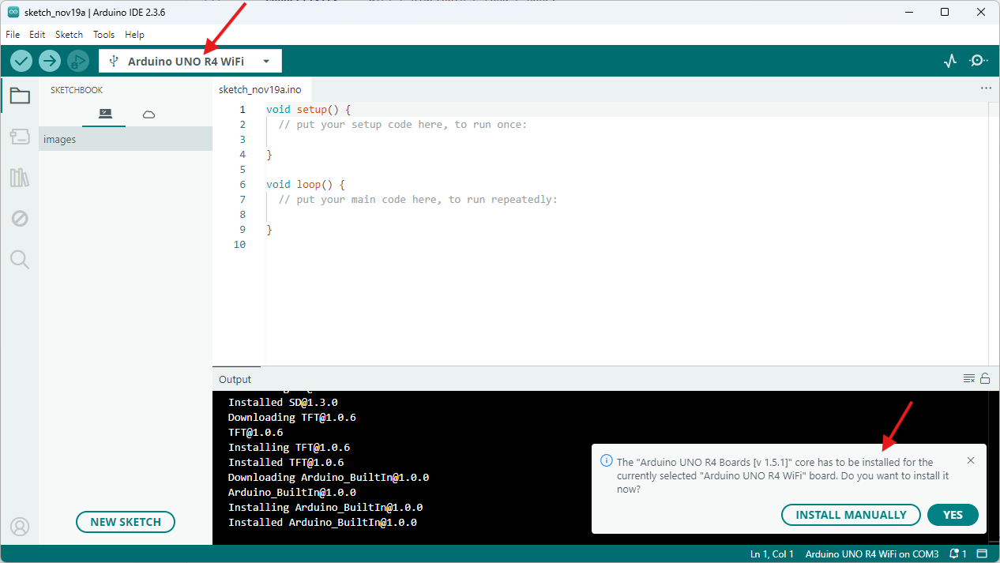
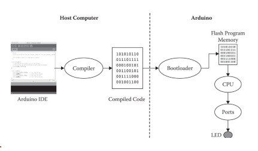
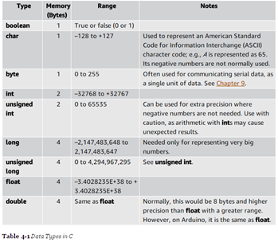

# Introduction to Arduino


## What is Arduino, and where does it come from?

**Arduino** is an open-source electronics platform that allows anyone to create interactive electronic projects. It combines **hardware** (the physical board) and **software** (the code that runs on it).

Arduino was first developed in **2003** at the **Interaction Design Institute Ivrea (IDII)** in Italy by **Massimo Banzi** and his colleagues. It was designed to make working with microcontrollers simpler and more affordable — especially for artists and designers without an engineering background.

From the start, Arduino used open-source hardware and software, meaning that **anyone can build, modify, or share** their designs freely. This open approach made it extremely popular in education, research, and hobby projects all around the world.


Above: the bar [“Arduino” in Ivrea](https://maps.app.goo.gl/5wCvfxTnYhPhZHdi7), where the founders used to meet and name their project.



The very first Arduino prototype — sweet memories!

🔗 You can visit the official site here: [**Arduino Website**](https://www.arduino.cc/)

---

## What can Arduino do (and what can’t it do)?

Arduino allows you to build small electronic systems that can **sense** the environment (through sensors) and **act** on it (through motors, lights, or displays). Typical projects include:

- Light sensors that control LEDs  
- Temperature and humidity monitors  
- Simple robots and servo motors  
- Smart home and IoT devices  

However, Arduino is **not a full computer** like a Raspberry Pi. It has no screen, keyboard, or operating system. Instead, it runs **one program at a time**, directly on the microcontroller.

Here’s how it compares:

| Feature | Arduino | Raspberry Pi |
|----------|----------|--------------|
| Type | Microcontroller | Mini computer |
| Operating System | None | Linux (Raspberry Pi OS) |
| Power Use | Very low | Higher |
| Programming | Simple (C/C++) | Advanced (Python, etc.) |
| Typical Use | Sensors, motors, lights | Web servers, AI, multimedia |

So while Arduino is small and limited in power, it’s **perfect for learning electronics and prototyping**.

Arduino has opened up the world of microcontrollers to everyone:

1. **Easy programming:** It uses a simplified version of the C language, designed for quick prototyping. Think of Arduino as a friendly *translator* between you and the microprocessor.  
2. **Hardware compatibility:** Not every microcontroller supports Arduino, but many do. For others, you can often install extra “board support packages.”  
3. **Reusability:** The same code (with small changes) can often run on different boards — from an Uno to a Nano or Mega.

The difference between Arduino and Raspberry Pi is not as clear-cut as it might seem. For example, while a Raspberry Pi can easily handle sensor-based projects, modern Arduino boards are now powerful enough to run lightweight AI applications. The newest addition to the Arduino family — the Arduino Q — even combines a traditional microcontroller with a Single Board Computer (SBC), further blurring the lines between the two platforms.

---

## The Arduino Language

The Arduino platform consists of **two parts**:  
1. The **hardware** (the physical board)  
2. The **software** (the code you write)

The programming language is based on **C/C++**, but simplified with built-in functions to make it easier to learn and use.

You write your code in the **Arduino IDE (Integrated Development Environment)** — a simple app that sends your program (called a *sketch*) to the board.

When you click *Upload*, the IDE compiles your human-readable code into **machine code** the microcontroller understands.

> [!NOTE]
> When you use a new type of board (like an ESP32 or a Nano 33 IoT), you may need to install the correct **board configuration** inside the IDE first.  

🔗 [Arduino IDE Download & Setup Guide](https://www.arduino.cc/en/software)

---

## The Arduino Ecosystem

Arduino is open-source — anyone can make their own version of the board or add extensions (called *shields*). This openness created a huge global community.

Today, there are countless Arduino-compatible boards from companies like:

- [Adafruit](https://www.adafruit.com/)
- [SparkFun](https://www.sparkfun.com/)
- [Seeed Studio](https://www.seeedstudio.com/)

You can find them easily on Amazon, eBay, or educational stores.  

👉 Tip: choose well-known brands — they come with better documentation and fewer hardware bugs.

---

# Our Board

For this course, we use the **Arduino Uno R4 WiFi**, a versatile entry-level board that includes WiFi and Bluetooth.



🔗 [Arduino Uno R4 WiFi Documentation](https://docs.arduino.cc/hardware/uno-r4-wifi/)

It’s great for:

- Connecting sensors and LEDs  
- Communicating with your computer or the internet  
- Running small, low-power programs  

Here’s a detailed feature list for the **[Arduino UNO R4 WiFi]()**


### Core Specifications

* Processor (MCU): Renesas RA4M1 (Arm® Cortex®-M4) running at **48 MHz**. 
* Flash memory: **256 kB** for program storage. 
* SRAM (RAM): **32 kB** for runtime data. 
* EEPROM (non-volatile data): **8 kB**. 
* Operating voltage for the main MCU: 5 V. 


###  Wireless & Coprocessor Features

* WiFi + Bluetooth® LE support via an on-board Espressif ESP32-S3 (module type ESP32-S3-MINI-1) up to 240 MHz. 


### I/O, Pins & Compatibility

* Maintains the traditional UNO form-factor: 14 digital I/O pins, 6 PWM outputs, analog inputs etc. 
* USB-C connector for programming and power. 
* VIN / barrel jack supports input voltages **6-24 V** (for the board’s regulator) enabling use in higher-voltage systems. 
* Qwiic I²C connector (for easy I²C external sensor expansion) and other modern expansion headers. 


###  Extra Features & Peripherals

* *12×8 LED matrix* built into the board (exclusive to the WiFi version) for simple visual feedback. 
* *VBuilt-in Real-Time Clock (RTC)* support (battery header) so you can maintain time even when powered down. 
* On-board logic level translation between the 5 V RA4M1 MCU and 3.3 V ESP32-S3 module. 

👉 The Uno R4 is an **all-rounder**, but keep in mind it is **relatively large** compared to some alternatives.  

# Alternatives You Might Explore  
## Choosing a Board  

There are many Arduino and Arduino-compatible boards available.  
When buying a board, students should consider:  
- **Size** – does it fit your project?  
- **Power** – do you need battery support or USB only?  
- **Connectivity** – WiFi / Bluetooth / LoRa / none?  
- **Pins** – how many sensors or actuators you want to connect  
- **Community support** – are there tutorials and documentation?
- **Features** – what are the extra fesatures on the board?  


### Adafruit Feather Boards  
- **Small, lightweight** boards designed for portability  
- Built-in **battery connector** for easy mobile projects  
- Many options available (WiFi, Bluetooth, LoRa, etc.)  
- Great if you want to build **wearables** or battery-powered devices  

📄 [Adafruit Feather Overview](https://learn.adafruit.com/adafruit-feather/feather-family)  


### ESP8266 Boards (e.g., NodeMCU)  
- Very **cheap** and widely available  
- Built on the popular **ESP8266 chip**  
- Powerful enough for most beginner IoT projects  
- Many variations exist (some even with **battery connector** built onto the board)  
- Strong community and huge number of tutorials  

📄 [NodeMCU ESP8266](https://www.nodemcu.com/)  


### Arduino Mega / Giga  
- Much **larger boards** with **many more pins**  
- Useful if you need to connect lots of sensors or devices at once  
- Same Arduino ecosystem, but not as compact as the Uno or Feather  

# Installation

Download and install the Arduino IDE from this page:
https://www.arduino.cc/en/software/#app-lab-section

The current version is 2.3.6. The installation is straightforward — just follow the steps and accept everything the installer asks for.

## Working Folder
Once installed, you might want to set the working folder in the prefernces:



## Connecting the board the first time



---

# Coding in Arduino (C/C++)

Each Arduino program (called a *sketch*) follows this basic structure:

1. **Libraries** — extra code you can include for sensors, motors, etc.  
2. **Variable declarations** — where you define numbers, pins, and settings.  
3. **`setup()`** — runs once when the board starts up.  
4. **`loop()`** — repeats forever while the board is running.  
5. **Functions** — custom blocks of code to keep things organized.

🔗 [Arduino Language Reference](https://www.arduino.cc/reference/en/)

The IDE compiles your sketch into machine code and uploads it to the board:



---

## 001 - Basic LED Blink

The classic first program — making the onboard LED blink once per second.

 [LED_BUILTIN](https://docs.arduino.cc/language-reference/en/variables/constants/ledbuiltin/) is a harcoded value. It adresses Pin 13 and the onboard LED. 

```cpp
void setup() {
  pinMode(LED_BUILTIN, OUTPUT);
}

void loop() {
  digitalWrite(LED_BUILTIN, HIGH);
  delay(1000);
  digitalWrite(LED_BUILTIN, LOW);
  delay(1000);
}
````

---

## 002 - Blink with Variables and Serial Feedback

Here we introduce a **variable** to control the timing and use the **Serial Monitor** to display messages.

### Memory Overview (Uno R4 WiFi)

* **EEPROM:** 8 KB (permanent storage)
* **RAM:** 32 KB (temporary variables)
* **FLASH:** 256 KB (your uploaded code)

### Common Data Types

| Type      | Size      | Example           | Description           |
| --------- | --------- | ----------------- | --------------------- |
| `boolean` | 1 bit     | `true` or `false` | On/off, yes/no values |
| `char`    | 1 byte (8 bits)    | `'A'`, `'1'`      | A single character    |
| `int`     | 2–4 bytes | `42`              | Whole number          |
| `float`   | 4 bytes   | `3.14`            | Decimal number        |

Typically, there is enough space for your code. But there can be problems — for example, very large text files combined with large libraries may cause memory issues.




```cpp
int pause = 50;

void setup() {
  Serial.begin(9600);
  pinMode(LED_BUILTIN, OUTPUT);
}

void loop() {
  digitalWrite(LED_BUILTIN, HIGH);
  delay(pause);
  digitalWrite(LED_BUILTIN, LOW);
  delay(pause);
  Serial.print("The delay is: "); 
  Serial.print(pause);
  Serial.println(" ms");
}
```

On an Arduino, the TX LED blinks whenever the board sends data over the serial port. 

---

## 003 - Blink Using a Function

A **function** helps organize code and avoid repetition.

```cpp
void setup() {
  Serial.begin(9600);
  pinMode(LED_BUILTIN, OUTPUT);
}

void loop() {
  flash(50, LED_BUILTIN);
  flash(500, LED_BUILTIN);
}

void flash(int pause, int ledNumber) {
  digitalWrite(ledNumber, HIGH);
  delay(pause);
  digitalWrite(ledNumber, LOW);
  delay(pause);
  Serial.print("The delay is: "); 
  Serial.print(pause);
  Serial.println(" ms");
}
```

---

## 004 - Control Structure: `if`

Using `if` statements to make decisions:

```cpp
bool fast = false;

void setup() {
  Serial.begin(9600);
  pinMode(LED_BUILTIN, OUTPUT);
}

void loop() {
  if (fast == true) {
    flash(50, LED_BUILTIN);
  } else {
    flash(400, LED_BUILTIN);
  }
}

void flash(int period, int led) {
  digitalWrite(led, HIGH);
  delay(period);
  digitalWrite(led, LOW);
  delay(period);
  Serial.print("The delay is: ");
  Serial.println(period);
}
```

---

## 005 - Repetition with `for` Loops

`for` loops repeat code a fixed number of times.

```cpp
void setup() {
  Serial.begin(9600);
  pinMode(LED_BUILTIN, OUTPUT);
}

void loop() {
  for (int i = 0; i < 10; i = i + 1) {
    Serial.print("Loop Nr. ");
    Serial.println(i);
    flash(20, LED_BUILTIN);
  }
}

void flash(int period, int led) {
  digitalWrite(led, HIGH);
  delay(period);
  digitalWrite(led, LOW);
  delay(period);
}
```

---

## 006 - Loops with Arrays

An **array** stores several values under one name. Here’s how to blink with different time delays.

```cpp
int timedelay[] = {200, 40, 50, 500, 70};

void setup() {
  Serial.begin(9600);
  pinMode(LED_BUILTIN, OUTPUT);
}

void loop() {
  for (int i = 0; i < 5; i++) {
    Serial.print("Loop Nr. ");
    Serial.print(i);
    Serial.print("\tDelay: ");
    Serial.println(timedelay[i]);
    flash(timedelay[i], LED_BUILTIN);
  }
}

void flash(int period, int led) {
  digitalWrite(led, HIGH);
  delay(period);
  digitalWrite(led, LOW);
  delay(period);
}
```

---

## 007 - Communicating via the Serial Monitor

You can **send data from your computer** to control your Arduino.

```cpp
void setup() {
  pinMode(LED_BUILTIN, OUTPUT);
  digitalWrite(LED_BUILTIN, LOW);
  Serial.begin(9600);
}

void loop() {
  if (Serial.available() > 0) {
    char letter = Serial.read();
    if (letter == '1') {
      digitalWrite(LED_BUILTIN, HIGH);
      Serial.println("LED is ON!");
    } else if (letter == '0') {
      digitalWrite(LED_BUILTIN, LOW);
      Serial.println("LED is OFF!");
    }
  }
}
```

Try typing `1` or `0` in the Serial Monitor!

---

## 008 - Sending and Receiving Messages

You can also send whole words or messages, not just single characters.

```cpp
void setup() {
  Serial.begin(9600);
}

void loop() {
  String message = "";
  if (Serial.available() > 0) {
    while (Serial.available() > 0) {
      message += char(Serial.read());
      delay(250);
    }
    Serial.print("You typed: ");
    Serial.println(message);
  }
}
```