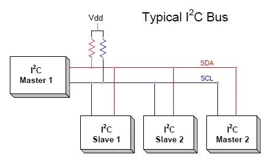
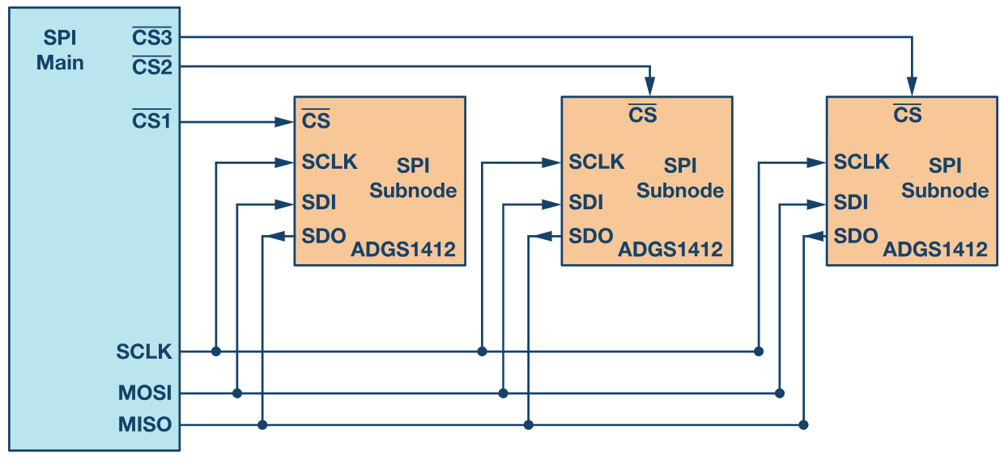
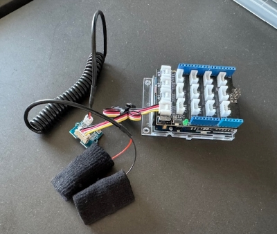
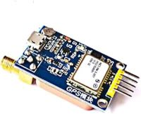
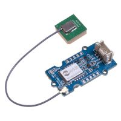
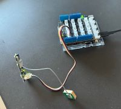
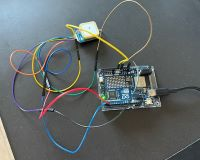
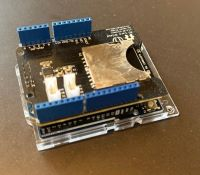
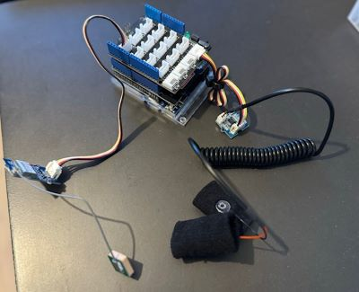

# Introduction to Arduino 2

## Communicating with External Devices
Your Arduino can communicate with external devices through various methods, with the choice of communication protocol depending on the devices you are connecting and specific circumstances.

We’ve already utilized **serial communication** in previous examples. Now, let's explore **I2C** and **SPI** communication protocols.

For an overview of common communication peripherals, refer to [Common Communication Peripherals](https://maker.pro/arduino/tutorial/common-communication-peripherals-on-the-arduino-uart-i2c-and-spi).

### Serial Communication (UART)
**Serial Communication**, also known as **UART** (Universal Asynchronous Reception and Transmission), is a fundamental communication method that enables USB-based communication with a computer. Two dedicated pins, **TX** and **RX**, assigned to ports 0 and 1, are used for this protocol, with LEDs that blink to show activity.


**Hardware Serial:** The UNO R4 WiFi board includes 2 separate hardware serial ports:

- One port exposed via USB-C®, and
- Another exposed via RX/TX pins.

Some boards, like the **Arduino Giga**, come with four hardware serial ports.

If physical ports are exhausted, virtual ports can be simulated on any two pins using the [**SoftwareSerial Library**](https://www.arduino.cc/en/Reference/softwareSerial).

For in-depth details on commands, visit the [**Serial Communication Reference Page**](https://www.arduino.cc/reference/en/language/functions/communication/serial/).

### I2C Protocol
The **I2C** protocol allows multiple sensors to connect to the same pin set. You can theoretically connect up to 128 sensors using just three pins and the same wiring. Although it is not the fastest protocol, it’s highly useful for connecting multiple devices.

I2C operates on a **Master-Slave** hierarchy, where each slave device has a unique address.



To use I2C, include the [Wire Library](https://www.arduino.cc/en/reference/wire).

Both [SparkFun](https://www.sparkfun.com/qwiic) and [Adafruit](https://www.adafruit.com/category/1005) offer connectors called Qwiic or STEMMA, which combine the I2C pins of development boards and breakout modules. With these connectors, you can connect compatible boards and modules with minimal wiring, enabling multifaceted projects quickly.

### SPI Protocol
**Serial Peripheral Interface (SPI)** is commonly used for devices like SD cards or display modules. Although faster than I2C, SPI supports only up to four devices and requires more wiring.

To use SPI, refer to the **SPI** library and assign four pins: three shared across devices and one specific to each device.



On the **Arduino R4 WiFi**, digital pins 10, 11, 12, and 13 are used for SPI communication. These are also available on the ICSP header.

Refer to the [SPI Library](https://www.arduino.cc/en/Reference/SPI).

### Grove System
Similar to SparkFun and Adafruit’s connectors, Seeed Studio offers the [Grove](https://wiki.seeedstudio.com/Grove_System/) system, a connector-focused solution without a specific communication protocol.

>[!Note]  
> These systems are compatible, allowing you to connect a Grove sensor to your Arduino alongside a SparkFun sensor. Jumper wires with a Grove or Stemma connector on one end and standard pins on the other allow for versatile component integration from different sources.

### Qwiic/STEMMA Connector
Qwiic and STEMMA are connector types by SparkFun and Adafruit, respectively, that combine the I2C pins of development boards and breakout modules. These connectors simplify multi-device setups, enabling rapid assembly with minimal wiring.

### WiFi and Bluetooth
The Arduino board includes two MCUs: the Renesas RA4M1 as the primary MCU, while the ESP32 handles WiFi and Bluetooth. The ESP32, although a standalone microprocessor, is configured as a slave to the Renesas on the Arduino UNO R4 WiFi, limiting direct access.

WiFi and Bluetooth cannot be used simultaneously.

WiFi:
WiFi is ideal for wireless data transmission and can also create local networks or host HTML pages, displaying sensor values on a webpage.

Bluetooth:
Bluetooth enables communication with phones, other Arduinos, and peripheral devices, although it does not support Windows PC connections.

---

## Coding Examples

### Grove GSR Sensor

**Introduction to Galvanic Skin Response**: [Grove GSR Sensor Wiki](https://wiki.seeedstudio.com/Grove-GSR_Sensor/)  



```cpp
const int GSRPIN = A0;
int gsr_sensorValue = 0;
int gsr_average = 0;

void setup() {
  Serial.begin(9600);
}

void loop() {

  long gsr_sum = 0;
  for (int i = 0; i < 50; i++)    //Average the 10 measurements to remove the glitch
  { gsr_sensorValue = analogRead(GSRPIN);
    gsr_sum += gsr_sensorValue;
    delay(5);
  }
  gsr_average = gsr_sum / 50;

  Serial.println(gsr_average);
}
```

---

### GPS Tracking on Arduino

**Introduction**  
GPS, or Global Positioning System, enables a receiver to obtain geolocation and time by connecting with at least four satellites. Accuracy depends on the signal quality, which in turn depends on satellite connectivity. The receiver itself is passive, receiving data but not transmitting back.

Our GPS receiver uses the NMEA 0183 protocol, which requires parsing the incoming signal with an external library into readable text. The data includes time and location, speed and altitude and so on. 

**GPS Modules** 
 
- Standard GPS Module  

- Grove GPS Module  


Both GPS modules work exaclty the same; the only difference is that the Grove GPS Module has a Grove connector, while the other uses a standard connector.

**Datasheet and Setup**  
Most GPS modules use serial communication (TX and RX pins for transmit/receive, VCC for power, and GND for grounding). Check both the GPS module’s specs and the manufacturer’s site for additional details:
- [uBlox NEO-6 Series Info](https://www.u-blox.com/en/product/neo-6-series)
- [Additional Module Info](https://www.waveshare.com/uart-gps-neo-7m-c-b.htm)

**GPS Library**  
Install the **TinyGPS++** library to parse incoming data.  
- [TinyGPS++ Library](http://arduiniana.org/libraries/tinygpsplus/)

**Wireing**
- Grove GPS    

- Other GPS     



**Steps Overview**  
- Initialize a serial connection to the GPS module
- Create a GPS object and check for updates
- Query data (e.g., date, time, position) and output

```cpp
#include <TinyGPS++.h>

/*the documentation of the tinyGPS library is http://arduiniana.org/libraries/tinygpsplus/
It just so happened that this sketch uses this library, there are many more

NOTE: You will see "Serial" and "Serial1". The board has two physical serial connections. 
One to communicate with your computer and one to communicate with your gps - same protocol, but two different ports and hence the name. 
*/

TinyGPSPlus gps;//This is the GPS object that carries the info we will extract

void setup() {
  Serial.begin(9600);//This opens up communications to the Serial monitor in the Arduino IDE and sets the speed. This is basically the connection to the computer
  Serial1.begin(9600);//This opens up communications to the GPS
  Serial.println("GPS Start\n**************************");//Just show to the monitor that the sketch has started
}

void loop()
{
  while (Serial1.available()) //While there is data coming from the GPS, do follwing...
  {
    gps.encode(Serial1.read());//...read the signal, transform into an object called "gps"
    }

  if (gps.location.isUpdated()) //if this object has been updated, do the following

  {
    //...Get the latest info from the gps object which it derived from the data sent by the GPS unit and print to to the serial monitor
    Serial.print("Satellite Count:\t");
    Serial.println(gps.satellites.value());
    Serial.print("Latitude:\t\t");
    Serial.println(gps.location.lat(), 6);
    Serial.print("Longitude:\t\t");
    Serial.println(gps.location.lng(), 6);
    Serial.print("Speed MPH:\t\t");
    Serial.println(gps.speed.mph());
    Serial.print("Altitude Feet:\t\t");
    Serial.println(gps.altitude.feet());
    Serial.print("Date:\t\t\t");
    Serial.println(gps.date.value());
    Serial.print("Time:\t\t\t");
    Serial.println(gps.time.value());
    Serial.println("__________________________________");
  }
}
```

**String Formatting in Code**

Characters like `\n` (new line) or `\t` (tab) are known as *Escape Characters*. These help with formatting the output and are good to remember.

### Improving Output Formatting

The code above provides a continuous stream of data formatted like this:

```cpp
__________________________________
Satellite Count:	4
Latitude:		51.540602
Longitude:		-0.045045
Speed MPH:		1.28
Altitude Feet:		173.88
Date:			271024
Time:			15131100
__________________________________
Satellite Count:	4
Latitude:		51.540575
Longitude:		-0.044995
Speed MPH:		1.28
Altitude Feet:		177.82
Date:			271024
Time:			15131200
__________________________________
Satellite Count:	4
Latitude:		51.540575
Longitude:		-0.044995
Speed MPH:		1.54
Altitude Feet:		177.82
Date:			271024
Time:			15131200
__________________________________
Satellite Count:	4
Latitude:		51.540547
Longitude:		-0.044967
Speed MPH:		1.54
Altitude Feet:		182.74
Date:			271024
Time:			15131300
```

Although the code works, the output is not ideal. It would be more readable for other applications (like excel) if each reading appeared on a single line in a table format. Like this:

```cpp
GPS Start
**************************
lat 	 long 	 speed 	 date 	 time
51.541278,-0.043498,0.00,271024,15244820
51.541278,-0.043498,0.00,271024,15244820
51.541135,-0.044873,0.00,271024,15245000
51.541135,-0.044873,0.28,271024,15245000
51.541133,-0.044907,0.28,271024,15245100
51.541133,-0.044907,0.00,271024,15245100
51.541138,-0.044925,0.00,271024,15245200
51.541138,-0.044925,0.00,271024,15245200
51.541132,-0.044930,0.00,271024,15245300
51.541132,-0.044930,0.00,271024,15245300
51.541132,-0.044930,0.00,271024,15245400
51.541132,-0.044930,0.00,271024,15245400
```
And the code goes like this: 

```cpp
#include <TinyGPS++.h>

TinyGPSPlus gps;

String Data = "";

void setup() {
  Serial1.begin(9600); // Opens communications to the GPS

  Serial.begin(9600); // Opens communications to the Serial monitor in the Arduino IDE and sets the speed (connection to the computer)
  Serial.println("GPS Start\n**************************"); // Displays the start message on the monitor
  Serial.println("lat \t long \t speed \t date \t time"); // Prints the header for the data columns
}

void loop()
{
  while (Serial1.available()) // While data is coming from the GPS, proceed as follows...
  {
    gps.encode(Serial1.read()); // Reads the signal and transforms it into an object called "gps"
  }

  if (gps.location.isUpdated()) // If this object has been updated, proceed with the following steps
  {
    Data = "";
    Data.concat(String(gps.location.lat(), 6));
    Data.concat(",");
    Data.concat(String(gps.location.lng(), 6));
    Data.concat(",");
    Data.concat(gps.speed.mph());
    Data.concat(",");
    Data.concat(gps.date.value());
    Data.concat(",");
    Data.concat(gps.time.value());
    Serial.println(Data);
  }
}
```

> [!NOTE]
> Notice the sequence `if (gps.location.isUpdated()) ...`. This ensures the line executes only when there is a signal. If no signal is available, the processor simply waits.

### Writing Data to an SD Card

**Introduction**  
Arduino can log data to an external SD card, and we’ll use the **SD Card Shield V4.0** from Seeedstudio for this. Most SD card shields work similarly, relying on SPI protocol to communicate with Arduino.

**Datasheet**  
As with all components, check the specs and wiring for compatibility.  

[SD Card Shield V4.0 Info](http://wiki.seeedstudio.com/SD_Card_shield_V4.0/)

**SD Library**  
The [**SD Library**](https://www.arduino.cc/en/reference/SD) in Arduino manages SD card file operations.  

**SPI Protocol**  
The SD card uses **SPI** protocol, which defines four pins (three shared and one device-specific). For our setup, connect shared pins via the ICSP header on the Arduino and assign pin 4 as the SS (Slave Select) pin.  

**SD Card Workflow**  
1. Verify connection and initialize the SD card
2. Open or create a file
3. Write data to the file
4. Close the file

**Code**

```cpp
#include <SPI.h> // This is the communication protocol 
#include <SD.h> // this is the library that allows you to have access to the SD Card. 

const int chipSelect = 4; // This is the pin that "activates" the SD card

File dataFile; // we have to create some sort of generic file 
String filename = "Data.csv";
String Data = "Entry Number: ";

int loopCount = 1;


void setup() {
  Serial.begin(9600);
  SD.begin(chipSelect);
  SD.remove(filename);
  String Header = "first entry during setup.";
  File dataFile = SD.open(filename, FILE_WRITE);
  if (dataFile)
  {
    dataFile.println(Header);
    dataFile.close();
  }
}

void loop()
{
  Data. concat (loopCount); 
  dataFile = SD.open(filename, FILE_WRITE);
  if (dataFile)
  {
    dataFile.println(Data);
    dataFile.close();
    Serial.println("New line sucessfully written: " + Data);
  }
  loopCount = loopCount + 1;
  Data = "Entry Number: ";
  delay(1000);
}
```

```cpp
first entry during setup.
Entry Number: 1
Entry Number: 2
Entry Number: 3
Entry Number: 4
Entry Number: 5
Entry Number: 6
Entry Number: 7
Entry Number: 8
Entry Number: 9
Entry Number: 10
Entry Number: 11
Entry Number: 12
Entry Number: 13
Entry Number: 14
...

```
###

---

### Combined GPS and GSR Datalogging




```cpp
#include <TinyGPS++.h>
#include <SPI.h>
#include <SD.h>

TinyGPSPlus gps;

// this is for the card
const int chipSelect = 4;

// this is for the gsr sensor
const int GSRPIN = A0;
int gsr_sensorValue = 0;
int gsr_average = 0;

// files and strings
File dataFile;
String filename = "Data.csv";
String Data = "";
String Header = "index \t lat \t long \t speed \t date \t time \t gsr";

// counter
int index = 0;

void setup() {

  Serial1.begin(9600);  //This opens up communications to the GPS

  Serial.begin(9600);      //This opens up communications to the Serial monitor in the Arduino IDE and sets the speed. This is basically the connection to the computer
  Serial.println(Header);  //and these are the values

  SD.begin(chipSelect);
  SD.remove(filename);
  File dataFile = SD.open(filename, FILE_WRITE);
  if (dataFile) {
    dataFile.println(Header);
    dataFile.close();
  }
}

void loop() {
  while (Serial1.available())  //While there is data coming from the GPS, do follwing...
  {
    gps.encode(Serial1.read());  //...read the signal, transform into an object called "gps"
  }

  if (gps.location.isUpdated())  //if this object has been updated, do the following
  {
    Data = "";
    // each reading has an index
    Data.concat(index);
    // This writes a line with the data coming from the gps
    Data.concat("\t");
    Data.concat(String(gps.location.lat(), 6));
    Data.concat("\t");
    Data.concat(String(gps.location.lng(), 6));
    Data.concat("\t");
    Data.concat(gps.speed.mph());
    Data.concat("\t");
    Data.concat(gps.date.value());
    Data.concat("\t");
    Data.concat(gps.time.value());

    // This reads the gsr sensor
    long gsr_sum = 0;
    for (int i = 0; i < 10; i++)  //Average the 10 measurements to remove the glitch
    {
      gsr_sensorValue = analogRead(GSRPIN);
      gsr_sum += gsr_sensorValue;
      delay(5);
    }
    gsr_average = gsr_sum / 10;
    Data.concat("\t");
    Data.concat(gsr_average);

    // and at the end of each reading cycle, it write the datapoint to the card
    dataFile = SD.open(filename, FILE_WRITE);
    if (dataFile) {
      dataFile.println(Data);
      dataFile.close();
      Serial.println(Data);
    }
    index = index + 1;
  }
}
```
And this is the result: 

```cpp
index 	 lat 	 long 	 speed 	 date 	 time 	 gsr
0	51.540530	-0.043872	0.00	271024	16540400	456
1	51.540530	-0.043872	0.28	271024	16540400	455
2	51.540527	-0.043863	0.28	271024	16540500	456
3	51.540527	-0.043863	0.36	271024	16540500	456
4	51.540522	-0.043860	0.36	271024	16540600	456
5	51.540522	-0.043860	0.49	271024	16540600	455
6	51.540518	-0.043855	0.49	271024	16540621	456
7	51.540518	-0.043855	0.55	271024	16540621	456
8	51.540518	-0.043853	0.55	271024	16540800	456
9	51.540518	-0.043853	0.40	271024	16540800	456
10	51.540518	-0.043863	0.40	271024	16540900	456
11	51.540518	-0.043863	0.40	271024	16540900	456
12	51.540515	-0.043865	0.40	271024	16541000	455
13	51.540515	-0.043865	0.06	271024	16541000	456
...
```

### Servo

This code is from the example libary and it makes the servo perfom a 180deg rotation. 

```cpp
#include <Servo.h>

Servo myservo;  // create servo object to control a servo
// twelve servo objects can be created on most boards

int pos = 0;    // variable to store the servo position

void setup() {
  myservo.attach(9);  // attaches the servo on pin 9 to the servo object
}

void loop() {
  for (pos = 0; pos <= 180; pos += 1) { // goes from 0 degrees to 180 degrees
    // in steps of 1 degree
    myservo.write(pos);              // tell servo to go to position in variable 'pos'
    delay(15);                       // waits 15 ms for the servo to reach the position
  }
  for (pos = 180; pos >= 0; pos -= 1) { // goes from 180 degrees to 0 degrees
    myservo.write(pos);              // tell servo to go to position in variable 'pos'
    delay(15);                       // waits 15 ms for the servo to reach the position
  }
}
```

> [!NOTE]  
> This servo operates at the same voltage as your Arduino. It’s small enough not to cause any harm when connected directly to the Arduino. However, if you switch to a stronger servo or motor, there’s a risk of damaging the Arduino. To prevent this, use a Motor Shield or build a custom circuit.

---


