# Introduction to Arduino 2

## Communicating with External Devices
Your Arduino can talk to external devices in several ways. The best protocol depends on the device you’re using and what you need (speed, distance, number of devices, etc.).

You’ve already used **Serial (UART)** in earlier examples. Below we also look at **I²C** and **SPI**.

For a friendly overview, see: [Common Communication Peripherals](https://maker.pro/arduino/tutorial/common-communication-peripherals-on-the-arduino-uart-i2c-and-spi).

---

### Serial Communication (UART)
**Serial (UART)** is the basic, point-to-point communication used to connect your board to a computer over USB and to many modules.

On most Arduinos you’ll see two dedicated pins: **TX** (transmit) and **RX** (receive). Their activity LEDs blink when data is moving.


**Hardware Serial on UNO R4 WiFi**
- **`Serial`**: the USB-C® port (Arduino ↔ computer).
- **`Serial1`**: the hardware TX/RX pins on the headers (Arduino ↔ external module).

Some boards (e.g., **Arduino GIGA**) have more hardware serial ports.

If you run out of hardware ports, you can sometimes use the
[**SoftwareSerial**](https://www.arduino.cc/en/Reference/softwareSerial) library to create a “virtual” serial port on other pins.  
> Note: SoftwareSerial isn’t supported or reliable on every non-AVR board. Prefer hardware serial when possible.

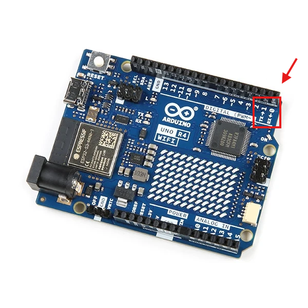

**Docs:** [Serial Reference](https://www.arduino.cc/reference/en/language/functions/communication/serial/)

---

### I²C Protocol
**I²C** lets you connect **many devices** (sensors, displays, etc.) on the **same two data lines**:
- **SDA** (data) and **SCL** (clock)
- Each device has a **7-bit address** (you can scan for it).

You can theoretically chain many devices on those two lines. I²C isn’t very fast but it’s simple and great for lots of small sensors.

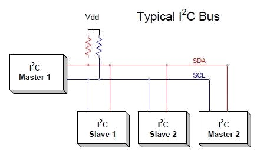

- Include the **Wire** library: [`#include <Wire.h>`](https://www.arduino.cc/en/reference/wire)
- On the UNO R4 WiFi you have dedicated **SDA/SCL** pins (and a JST-SH **Qwiic/STEMMA QT** I²C connector).
- I²C lines usually need **pull-up resistors**. Most breakout boards already include them.

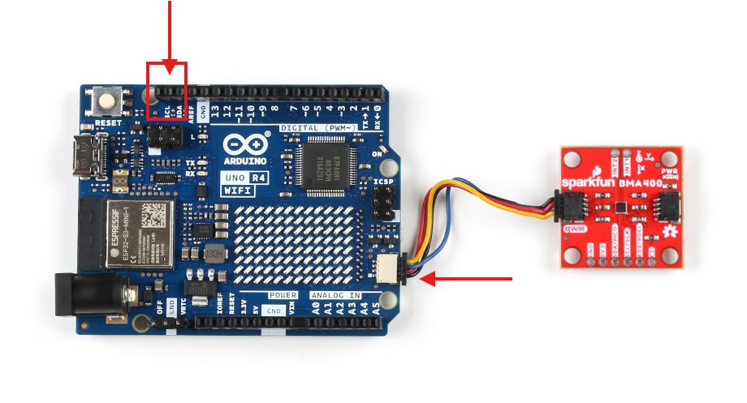

**Qwiic / STEMMA QT**  
SparkFun’s **Qwiic** and Adafruit’s **STEMMA QT** are just small 4-pin I²C connectors (GND, 3V3/5V, SDA, SCL). They make I²C “plug-and-play”.

- SparkFun Qwiic: https://www.sparkfun.com/qwiic
- Adafruit STEMMA QT: https://www.adafruit.com/category/1005

---

### SPI Protocol
**SPI** is a faster bus often used for **SD cards**, **displays**, and high-speed sensors.

- It uses shared lines **SCK**, **MOSI**, **MISO**, plus a **CS/SS** (chip-select) **per device**.
- Faster than I²C, but needs more wires and one CS pin per device.

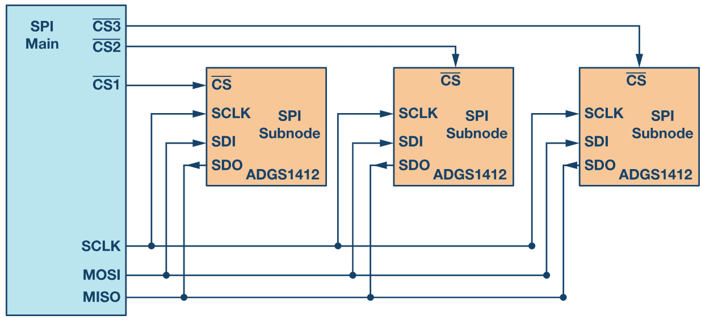

**UNO R4 WiFi SPI pins**
- Header pins: **10 (SS)**, **11 (MOSI)**, **12 (MISO)**, **13 (SCK)**
- Also available on the **ICSP** header (preferred for shields).

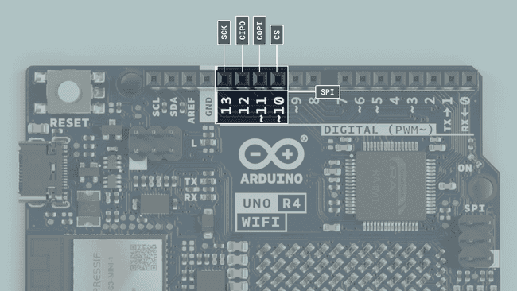

Use the **SPI** library: [SPI Reference](https://www.arduino.cc/en/Reference/SPI)

---

### Grove System
Seeed Studio’s **Grove** is a connector system (like Qwiic/STEMMA QT) that makes wiring simple. Grove modules can carry **I²C, UART, analog, or digital** signals—there is no single “Grove protocol.”

- Grove: https://wiki.seeedstudio.com/Grove_System/

> [!NOTE]
> These ecosystems are compatible with simple adapters/jumper cables. You can connect a **Grove** sensor to an Arduino that also has **Qwiic/STEMMA QT** devices if you match the right pins (power and signals).

---

### WiFi and Bluetooth (UNO R4 WiFi)
The UNO R4 WiFi has **two MCUs**:
- **Renesas RA4M1** (main microcontroller, runs your sketch)
- **ESP32-S3** (handles **WiFi** and **Bluetooth® LE**)

On the UNO R4 WiFi, the ESP32-S3 is set up as a **coprocessor** for connectivity. You typically use Arduino WiFi/BLE libraries that talk to it behind the scenes.

- **WiFi** is great for sending data to the web, local dashboards, or simple web servers (showing sensor data in a page).
- **Bluetooth LE** is great for talking to phones or other BLE devices.

> Note: On this board you generally **don’t use WiFi and BLE at the same time**.

BLE on Windows is not working; phones (iOS/Android) are usually the easiest target.

---

## Coding Examples

### Grove GSR Sensor

**Galvanic Skin Response (GSR)** measures skin conductance (related to sweat gland activity).

Grove GSR Wiki: https://wiki.seeedstudio.com/Grove-GSR_Sensor/

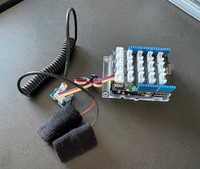

```cpp
const int GSRPIN = A0;
int gsr_sensorValue = 0;
int gsr_average = 0;

void setup() {
  Serial.begin(9600);
}

void loop() {
  long gsr_sum = 0;

  // Average 50 readings for smoother data
  for (int i = 0; i < 50; i++) {
    gsr_sensorValue = analogRead(GSRPIN);
    gsr_sum += gsr_sensorValue;
    delay(5);
  }
  gsr_average = gsr_sum / 50;

  Serial.println(gsr_average);
}
````

[`analogReadResolution()`](https://docs.arduino.cc/language-reference/en/functions/analog-io/analogReadResolution/) let you set the resolution (in bits) of the value returned by analogRead(). It defaults to 10 bits (returns values between 0-1023) for backward compatibility with AVR based boards.

Within the Arduino boards you can find a variety of resolutions that lead to different ranges:

- 10 bits: allow values between 0 and 1023. 
- 12 bits: allow values between 0 and 4095. 
- 14 bits: allow values between 0 and 16383. 
- 16 bits: allow values between 0 and 65535.


---

### GPS Tracking on Arduino

**What is GPS?**
GPS gives a receiver its position/time by listening to satellite signals (no transmit from the receiver). Accuracy depends on sky view and satellite lock.

Our modules send **NMEA** sentences over **UART**. We parse them with a library.

**Modules**

* Standard GPS module
  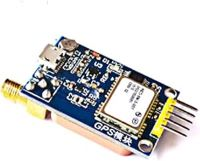
* Grove GPS module
  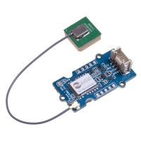

Functionally they’re the same; the Grove version just has the Grove connector.

**Data & Setup**

* Typical pins: **VCC**, **GND**, **TX**, **RX**
* Example modules/specs:

  * u-blox NEO-6: [https://www.u-blox.com/en/product/neo-6-series](https://www.u-blox.com/en/product/neo-6-series)
  * Another module: [https://www.waveshare.com/uart-gps-neo-7m-c-b.htm](https://www.waveshare.com/uart-gps-neo-7m-c-b.htm)

**Library**

* **TinyGPS++**: [http://arduiniana.org/libraries/tinygpsplus/](http://arduiniana.org/libraries/tinygpsplus/)

**Wiring**

* Grove GPS
  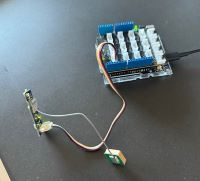
* Other GPS
  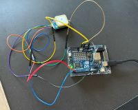

**Steps**

1. Open a serial port to the GPS (**`Serial1`** on UNO R4 WiFi).
2. Feed bytes into TinyGPS++.
3. When updated, read position/time/speed and print.

```cpp
#include <TinyGPS++.h>

/*
TinyGPS++ docs: http://arduiniana.org/libraries/tinygpsplus/

Note: On UNO R4 WiFi, use:
- Serial  : USB (to computer / Serial Monitor)
- Serial1 : pins for GPS module
*/

TinyGPSPlus gps;

void setup() {
  Serial.begin(9600);   // to Serial Monitor
  Serial1.begin(9600);  // to GPS module
  Serial.println("GPS Start\n**************************");
}

void loop() {
  // Read all available GPS bytes
  while (Serial1.available()) {
    gps.encode(Serial1.read());
  }

  // Print when a fresh fix arrives
  if (gps.location.isUpdated()) {
    Serial.print("Satellite Count:\t"); Serial.println(gps.satellites.value());
    Serial.print("Latitude:\t\t");      Serial.println(gps.location.lat(), 6);
    Serial.print("Longitude:\t\t");     Serial.println(gps.location.lng(), 6);
    Serial.print("Speed MPH:\t\t");     Serial.println(gps.speed.mph());
    Serial.print("Altitude Feet:\t\t"); Serial.println(gps.altitude.feet());
    Serial.print("Date:\t\t\t");        Serial.println(gps.date.value());
    Serial.print("Time:\t\t\t");        Serial.println(gps.time.value());
    Serial.println("__________________________________");
  }
}
```

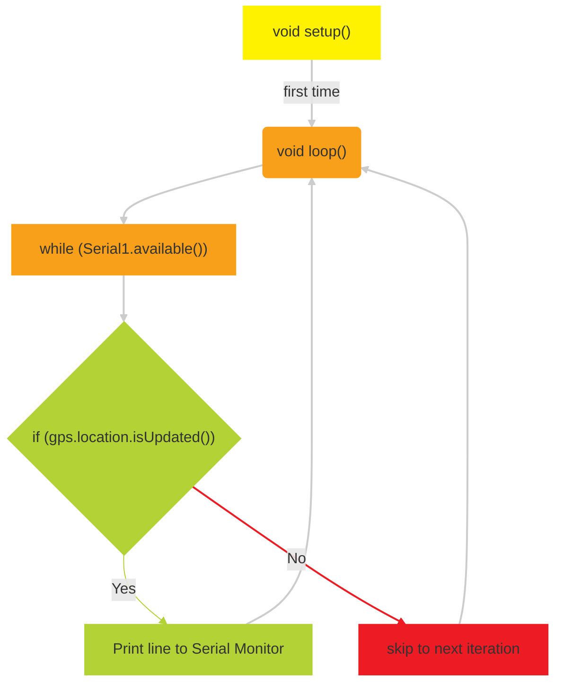
```mermaid
flowchart TD
    A["void setup()"] -->|first time| B("void loop()")
    B --> C["while (Serial1.available())"]
    
    C --> D{"if (gps.location.isUpdated())"}
    D -->|Yes| E[Print line to Serial Monitor]
    D -->|No| F[skip to next iteration]
    
    E --> B
    F --> B
    

    style A fill:#fff200,stroke:#fff200,stroke-width:4px
    style B fill:#f9a01b,stroke:#f9a01b,stroke-width:2pxpx
    style C fill:#f9a01b,stroke:#f9a01b,stroke-width:2pxpx
    style D fill:#b2d235,stroke:#b2d235,stroke-width:4pxpx
    style E fill:#b2d235,stroke:#b2d235,stroke-width:4pxpx
    style F fill:#ed1c24,stroke:#ed1c24,stroke-width:2pxpx
    classDef default fill:#ccc,stroke:#ccc,stroke-width:1px
    class A,B,C,D,E,F default
    linkStyle 0 stroke:#ccc,stroke-width:2px
    linkStyle 1 stroke:#ccc,stroke-width:2px
    linkStyle 2 stroke:#ccc,stroke-width:2px
    linkStyle 3 stroke:#b2d235,stroke-width:2pxpx
    linkStyle 4 stroke:#ed1c24,stroke-width:2px
    linkStyle 5 stroke:#ccc,stroke-width:2px
    linkStyle 6 stroke:#ccc,stroke-width:2px                

    


```

**Escape characters** like `\n` (new line) and `\t` (tab) help format text.

**CSV-style output (easier for Excel/analysis)**

```cpp
#include <TinyGPS++.h>

TinyGPSPlus gps;
String Data = "";

void setup() {
  Serial1.begin(9600);      // GPS
  Serial.begin(9600);       // Serial Monitor
  Serial.println("GPS Start\n**************************");
  Serial.println("lat \t long \t speed \t date \t time");
}

void loop() {
  while (Serial1.available()) {
    gps.encode(Serial1.read());
  }

  if (gps.location.isUpdated()) {
    Data = "";
    Data.concat(String(gps.location.lat(), 6)); Data.concat(",");
    Data.concat(String(gps.location.lng(), 6)); Data.concat(",");
    Data.concat(gps.speed.mph());               Data.concat(",");
    Data.concat(gps.date.value());              Data.concat(",");
    Data.concat(gps.time.value());
    Serial.println(Data);
  }
}
```

> [!NOTE]
> The `if (gps.location.isUpdated())` guard ensures you only print when a new fix arrives.

---

### Writing Data to an SD Card

**Intro**
Data logging to SD is common. We use Seeed’s **SD Card Shield V4.0** here, but most shields are similar and use **SPI**.

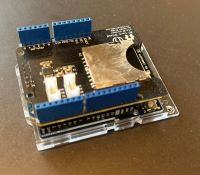
Shield info: [http://wiki.seeedstudio.com/SD_Card_shield_V4.0/](http://wiki.seeedstudio.com/SD_Card_shield_V4.0/)

**Libraries**

* [`#include <SPI.h>`](https://www.arduino.cc/en/Reference/SPI)
* [`#include <SD.h>`](https://www.arduino.cc/en/reference/SD)

**Pins**

* Use the **ICSP** header (MOSI/MISO/SCK) plus a **CS/SS** pin (often **D4** on shields). Check your shield’s label.

**Typical flow**

1. `SD.begin(CS)`
2. `SD.open(...)` (create/append)
3. `file.println(...)`
4. `file.close()`

```cpp
#include <SPI.h>
#include <SD.h>

const int chipSelect = 4;    // Shield’s CS pin (check your shield)
File dataFile;
String filename = "Data.csv";
String Data = "Entry Number: ";
int loopCount = 1;

void setup() {
  Serial.begin(9600);

  if (!SD.begin(chipSelect)) {
    Serial.println("SD init failed.");
    while (1) { delay(10); }
  }

  SD.remove(filename); // start clean (optional)

  File dataFile = SD.open(filename, FILE_WRITE);
  if (dataFile) {
    dataFile.println("first entry during setup.");
    dataFile.close();
  }
}

void loop() {
  Data.concat(loopCount);

  dataFile = SD.open(filename, FILE_WRITE);
  if (dataFile) {
    dataFile.println(Data);
    dataFile.close();
    Serial.println("New line successfully written: " + Data);
  } else {
    Serial.println("Error opening file.");
  }

  loopCount = loopCount + 1;
  Data = "Entry Number: ";
  delay(1000);
}
```

Example output:

```text
first entry during setup.
Entry Number: 1
Entry Number: 2
Entry Number: 3
...
```

---

### Combined GPS + GSR Data Logging (to SD)

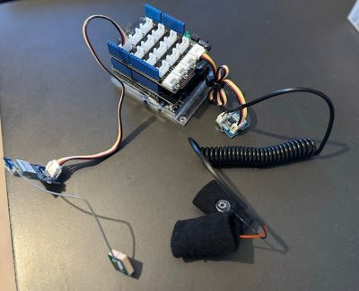

```cpp
#include <TinyGPS++.h>
#include <SPI.h>
#include <SD.h>

TinyGPSPlus gps;

// SD
const int chipSelect = 4;

// GSR
const int GSRPIN = A0;
int gsr_sensorValue = 0;
int gsr_average = 0;

// File & strings
File dataFile;
String filename = "Data.csv";
String Data = "";
String Header = "index \t lat \t long \t speed \t date \t time \t gsr";

// Counter
int index = 0;

void setup() {
  Serial1.begin(9600); // GPS
  Serial.begin(9600);  // Monitor
  Serial.println(Header);

  if (!SD.begin(chipSelect)) {
    Serial.println("SD init failed.");
    while (1) { delay(10); }
  }

  SD.remove(filename);
  File dataFile = SD.open(filename, FILE_WRITE);
  if (dataFile) {
    dataFile.println(Header);
    dataFile.close();
  }
}

void loop() {
  // Feed GPS parser
  while (Serial1.available()) {
    gps.encode(Serial1.read());
  }

  // On new fix, read GPS + GSR and store a line
  if (gps.location.isUpdated()) {
    Data = "";
    Data.concat(index);                    Data.concat("\t");
    Data.concat(String(gps.location.lat(), 6)); Data.concat("\t");
    Data.concat(String(gps.location.lng(), 6)); Data.concat("\t");
    Data.concat(gps.speed.mph());          Data.concat("\t");
    Data.concat(gps.date.value());         Data.concat("\t");
    Data.concat(gps.time.value());         Data.concat("\t");

    // Average a few GSR readings
    long gsr_sum = 0;
    for (int i = 0; i < 10; i++) {
      gsr_sensorValue = analogRead(GSRPIN);
      gsr_sum += gsr_sensorValue;
      delay(5);
    }
    gsr_average = gsr_sum / 10;
    Data.concat(gsr_average);

    dataFile = SD.open(filename, FILE_WRITE);
    if (dataFile) {
      dataFile.println(Data);
      dataFile.close();
      Serial.println(Data);
    }

    index = index + 1;
  }
}
```

Sample output:

```text
index    lat        long        speed   date    time      gsr
0        51.540530  -0.043872   0.00    271024  16540400  456
1        51.540530  -0.043872   0.28    271024  16540400  455
...
```

---

### Servo

This example rotates a hobby servo from 0° → 180° → 0°.

```cpp
#include <Servo.h>

Servo myservo;

int pos = 0;

void setup() {
  myservo.attach(9);  // control signal on pin D9
}

void loop() {
  for (pos = 0; pos <= 180; pos += 1) {
    myservo.write(pos);
    delay(15);
  }
  for (pos = 180; pos >= 0; pos -= 1) {
    myservo.write(pos);
    delay(15);
  }
}
```

> [!NOTE]
> Small servos can often be powered from the Arduino for quick tests.
> For **bigger servos or motors**, use an **external power supply** and a **motor/servo driver** to avoid damaging the board.


