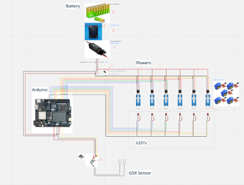
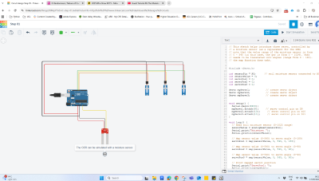
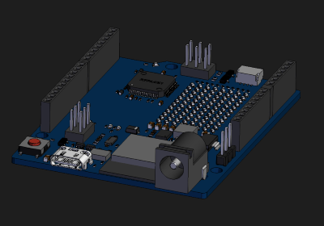
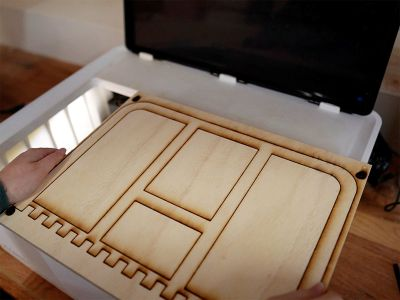
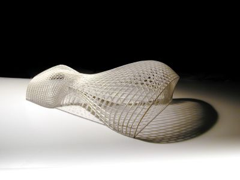
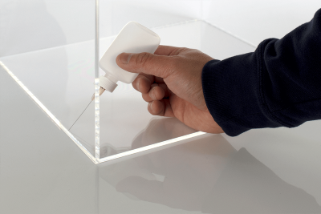
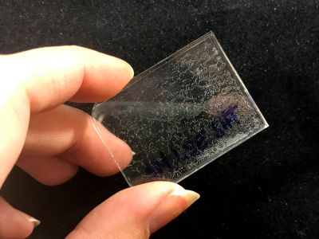
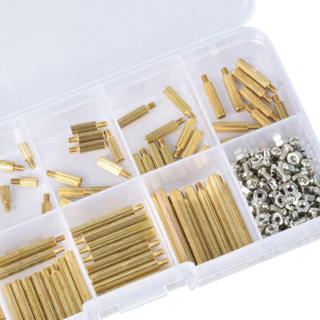

# Design to Fabrication

## Design of the unit

You can design your prototype in many different ways. Some people like to start building physically very early, while others prefer to stay longer in the digital design phase and reduce the time spent on physical prototyping. Both approaches are valid.

What you must keep in mind is that your unit has **several design layers**:

* the **code** needs to be designed,
* the **physical wiring** needs to be planned,
* and the **unit itself** needs to be designed.

While it is obvious that the Arduino code and the physical object require design, the **electronics assembly** is often forgotten.

When it comes to assembling the electronic components, you should think about:

* How does the wiring run through the unit?
* Where does the battery sit?
* How can I replace the battery?
* Is the battery strong enough?
* How are the boards fixed inside the unit?

### Miro

Miro is useful if you want to sketch the wiring diagram and get a first understanding of how everything connects.

### Tinkercad

[Tinkercad](https://www.tinkercad.com/) is an Autodesk website that allows simple code and component simulation. You can build a virtual prototype, write your code, and test it digitally. This is a helpful way to experiment —however, the number of sensors and components is limited.

### Polycam

[Polycam](https://poly.cam) is an iPhone app that lets you create 3D scans of objects such as your head or arms. These 3D scans can be exported and opened in Rhino. This allows you to design with accurate body geometry. Unfortunately, Polycam is not free.
As an alternative, **B-Made** also has a 3D scanner, but it requires a separate [induction](https://moodle.ucl.ac.uk/course/view.php?id=39723&section=46#tabs-tree-start) before use.

### GrabCAD

[GrabCAD](https://grabcad.com/library) is a website where you can download 3D models of your boards and components. Download them and open them in Rhino—there is no need to remodel these parts yourself.

A 3D file of the Arduino R4 WiFi

## Lasercutting

B-Made offers a flexible laser-cutting service that lets you cut sheets at short notice. You will usually get the best results with **acrylic sheets** — transparent, coloured, or opaque. It is also possible to laser-cut **wood**, but this often leaves **charred, dark edges**, which may not look very clean.

Laser cutters can do more than just cut material — they can **engrave patterns** as well. Since every laser-cutting workshop uses slightly different machines, it’s important to know how to prepare your file properly.

Typically, you submit a **CAD file** that includes:

* the **size of your sheet**,
* and **lines** showing what should be cut or engraved — usually separated by **colour** or **layer**.

Make sure there are **no overlapping lines**, otherwise the laser will cut the same path twice.

Tools such as [OpenNest](https://www.food4rhino.com/en/app/opennest) help you arrange your geometry on the sheets efficiently, reducing waste and cutting time.

Most importantly, laser cutting leads to a very specific aesthetic. It naturally produces **contours, frames, and flat profiles**, rather than the solid, volumetric look you get from 3D printing.

**Glueing Arcylic**

Most model shops sell special glue for acrylic, often called **acrylic weld**. It is transparent and has a very thin, alcohol-like consistency. You apply it with a fine brush or a syringe. Be careful when using it and always work in a **well-ventilated space**, as the fumes are toxic.

Acrylic weld creates **very strong, seamless joints** because it actually melts and fuses the two acrylic pieces together. The bond is strong and transparent. However, because the glue is so thin, you can only apply it to **edges or small contact points** — you **cannot** use it to glue two flat faces together.

Gluing **along an edge** works well.

But **do not** try to glue two large flat surfaces together — it will not work. Don’t insist, don’t try — trust me... 

## 3D Printing

3D printing requires submitting a 3D file to a printing service, either at UCL or externally. Whether you are printing with filament or SLS, the basic principles are the same. Below is some general advice aimed at avoiding the most common pitfalls for first-time printers.

**Watertight Models**

Your geometry needs to be converted into a mesh, and that mesh must be *watertight* — meaning no holes, gaps, or naked edges.
Several software packages can help you control and repair meshes, but Rhino already provides a strong set of tools. Here is an excellent [video series](https://vimeopro.com/rhino/preparing-to-3d-print) that explains how to prepare models for 3D printing. It goes without saying that it is important to *model cleanly from the beginning*. Badly modelled geometry often requires significant time to fix later.

**Scale**

Every machine has a minimum printable resolution. Very small details may not print well or may disappear entirely. Find out the minimum feature size of your printer and adjust your model accordingly.

**Size**

3D printing is not ideal for large, monolithic parts. They take a long time to print and cool, and over time they can *warp, distort, or crack*.

This white SLS piece, for example, was too large — approximately 400 mm in length. It would have been faster and cheaper to break it into smaller components.
Alternatively, if the design allows, you can replace large solid areas with *lighter, skeletal structures* to avoid warping.

**Connections to Other Materials**

SLA and SLS prints are notoriously weak and brittle. They split easily and cannot hold much pressure. This is usually fine for model-making, but extra care is needed when connecting them to screws, fasteners, or mechanical components.

For example: *you cannot screw directly into SLS or SLA*.
Instead, you must design your part to accept *threaded inserts*, such as heat-set or press-fit inserts. Here is a helpful guide: [Threaded inserts](https://uk.rs-online.com/web/content/discovery/ideas-and-advice/threaded-inserts-guide)

##  Standoff Spacer 

You can fix boards to any base using standoff spacers.

## Prototyping boards and soldering

## PCB Design

---

# Network Protocols

This chapter explains the main ways you can send data between an **Arduino**, a **phone**, and **Grasshopper**. Each method has different strengths. Some work through a USB cable, others use WiFi, and some are designed to send data across the internet. The goal is to understand how the protocols work before we look at the practical examples.

## 1. Arduino to Grasshopper (Serial Communication)

The simplest way to connect an Arduino to Grasshopper is through a USB cable.
When the Arduino is connected, it sends numbers or text through the **serial port**, and Grasshopper reads it. This is fast, very stable, and easy to set up.

In practice, the Arduino uses commands like `Serial.print()` to send data. Grasshopper listens to this stream and turns it into values you can use to move geometry, record sensor readings, or trigger events. The only thing you need to be careful about is the **data format**. If the Arduino sends messy strings or too much text, Grasshopper has trouble reading it. A clean format with commas or line breaks works best.

Serial communication is ideal for first experiments, classroom prototypes, and situations where a cable is acceptable. You will use this method in the examples later.

## 2. OSC (Open Sound Control) Protocol

OSC is a wireless protocol that runs over WiFi. It is widely used in media art, performance, interactive installations, and creative coding. OSC is fast and flexible and works across many platforms.

 **Arduino → Grasshopper with OSC**

If your Arduino has WiFi (for example an ESP32 or Arduino R4 WiFi), it can join your home or studio network and send data wirelessly to Grasshopper. This feels very different from the serial cable: the Arduino becomes a small network device that broadcasts messages. Grasshopper receives these OSC messages and can react in real time. This is very useful when your prototype needs to move freely, or when you cannot have long cables.

**iPhone → Grasshopper with OSC**

Phones can also send OSC. With apps like TouchOSC or similar tools, your iPhone becomes a wireless sensor: it can send its accelerometer, gyroscope, touchscreen positions, or custom sliders straight into Grasshopper. This is an easy way to build a quick controller or to test interactions without building hardware.

 **Grasshopper → Grasshopper with OSC**

You can even send OSC between two different Grasshopper sessions. This is helpful if you want to split tasks between two laptops. One computer can do heavy calculations, and the other one can visualise the results. As long as both machines are on the same WiFi network, the communication is instant.

OSC works very well in all these cases, but it is limited to the local network. It does not naturally send data across long distances or through the internet.

## 3. MQTT

MQTT is a protocol designed for the “Internet of Things.” It is different from Serial and OSC because it does not send data directly from one device to another. Instead, every device sends its data to a **broker**, which is a server. Other devices can subscribe to the same topic and receive the messages. This creates a very flexible system.

With MQTT you can connect an Arduino, your phone, and Grasshopper even if they are not in the same room or even the same city. As long as they all connect to the broker, they can talk to each other. This makes MQTT very good for long-distance communication, building-wide sensor networks, or projects that need to collect data over many hours or days.

The setup takes a bit more work, because you need an MQTT broker (for example HiveMQ Cloud or Mosquitto), but once it is running, the system is extremely stable. MQTT is used in smart homes, environmental sensors, and many large-scale IoT projects.

