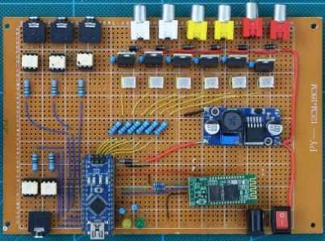
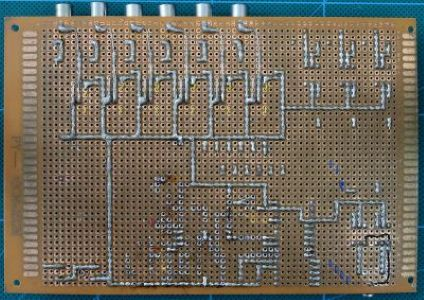
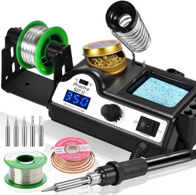
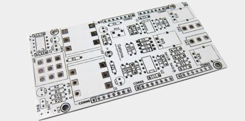
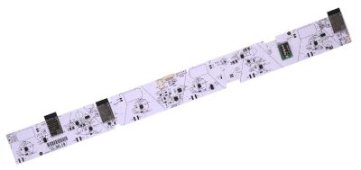
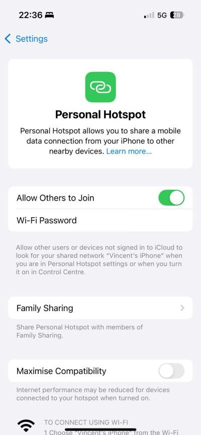

# **Design to Fabrication**


[](https://www.youtube.com/watch?v=rmlmOk4ubcU)

*Jamiroquai hat of [Studio Waldemeyer](https://www.waldemeyer.com/projects/jamiroquai)*

## Designing Your Wearable / Prototype Unit

There is no single correct way to design your prototype.
Some students prefer to start building physically straight away, while others stay longer in the digital design phase and move to fabrication later. Both approaches are valid.

However, every successful prototype has *three interconnected design layers*:

1. **Code** — the logic, behaviour, and data flow
2. **Electronics** — sensors, wiring, power, components
3. **Physical object** — casing, structure, material, assembly

Students often focus heavily on code and the physical object, while forgetting the electronic assembly in between.
Good prototypes integrate all three layers from the beginning.

### Questions to guide your design

When planning the electronics, consider:

* How does the **wiring** run through the unit? Is it neat and safe?
* Where does the **battery** sit?
* Can you **replace** the battery easily?
* Is the battery **strong enough** for your sensors and runtime?
* How are the **boards fixed** inside the unit?
* Is anything likely to **break loose** while worn on the body?

These decisions should be part of your early design process—just like code structure or 3D geometry.

---

## Digital Tools for Early Design

### Miro

Miro is useful for sketching quick wiring diagrams and mapping how sensors, batteries, and boards connect.
It’s perfect for early idea development.


### Tinkercad

[Tinkercad](https://www.tinkercad.com/) allows you to build simple digital prototypes.
You can:

* drag electronic components
* wire them together
* write Arduino code
* test small circuits in simulation

The number of available sensors is limited, but it is a great starting point for beginners.


### Polycam

[Polycam](https://poly.cam) lets you scan body parts (head, arm, chest) directly with your iPhone.
These scans can be exported and opened in Rhino, allowing you to design around **accurate body geometry** — extremely helpful for wearables.

Polycam is not free.
As an alternative, **B-Made** has a 3D scanner you can use after completing the required [induction](https://moodle.ucl.ac.uk/course/view.php?id=39723&section=46#tabs-tree-start).


### GrabCAD

[GrabCAD](https://grabcad.com/library) provides 3D models of nearly all electronics components and development boards.
Simply download the models and place them in Rhino.
There is no need to remodel Arduinos, batteries, sensors, servos, or screws.


*A 3D file of the Arduino R4 WiFi downloaded from GrabCAD*


# Laser Cutting

B-Made offers a very flexible laser-cutting service, often with short turnaround times.

The material that gives the cleanest result is acrylic:

* transparent
* coloured
* or opaque

Wood can also be laser-cut, but it often burns at the edges, leaving dark, charred outlines.


### Preparing your file

Laser cutters read 2D vector files. You need to provide:

* a rectangle showing the **sheet size**,
* coloured **lines** indicating what should be cut or engraved.

Different laser cutters follow different colour conventions, so always check the workshop guidelines.

**Important:**
Make sure **no duplicate lines** are overlapping. If two lines sit in the same place, the laser will cut the same path twice — burning the edge or melting the acrylic.

Tools like [OpenNest](https://www.food4rhino.com/en/app/opennest) help you arrange your pieces efficiently, reducing waste and fabrication time.


### **Aesthetics of laser cutting**

Laser cutting naturally produces:

* flat profiles
* frames and ribs
* layered silhouettes

It is not ideal for smooth 3D forms — that’s where 3D printing or CNC milling is better.


## Gluing Acrylic

Most model shops sell acrylic glue (also called *acrylic weld*).
It is a thin, transparent liquid that melts the acrylic slightly, fusing the parts together.

**Safety:**
Use it in a well-ventilated room. The fumes are strong and unhealthy.

**Key points:**

* Welds are very strong, but
* the glue can only be applied to *edges* or *small contact points*
* it **cannot** bond two large flat faces — the glue evaporates too quickly


Gluing an *edge joint* works perfectly:


Do **not** try to glue large surfaces together.
Don’t insist, don’t try — trust me.


# 3D Printing

3D printing requires submitting a 3D file to a printing service at UCL or externally.
Whether using filament (FDM) or SLS, the same principles apply.

### 1. Watertight Models

Your mesh must be **closed** — no holes, no gaps, no naked edges.

Rhino has good mesh-repair tools, and this [video series](https://vimeopro.com/rhino/preparing-to-3d-print) explains the entire process.

The best strategy is to **model cleanly from the beginning**, avoiding unnecessary complexity.


### 2. Minimum Feature Size

Every printer has a limit.
Very small details (thin walls, tiny holes, sharp corners) may:

* not print at all
* break off
* melt into blobs

Always check the recommended minimum thickness for your chosen printer.


### 3. Size and Warping

Large monolithic prints take a long time and may crack or deform.


This SLS piece (≈400 mm) was too large. A better approach would have been:

* splitting it into smaller components, or
* using a *lightweight structure with large holes* instead of large solid volumes.


### 4. Screws, Inserts, and Connections

SLA and SLS prints are *brittle*. You cannot screw directly into them.

Instead, design for *threaded inserts* (heat-set, press-fit).
Here is a good [guide.](https://uk.rs-online.com/web/content/discovery/ideas-and-advice/threaded-inserts-guide)


# Standoff Spacers

To mount boards, you can use *standoff spacers*.
They keep the PCB elevated and prevent shorts.


# Prototyping Boards and Soldering

For more permanent electronics, use a *prototyping board* with *soldering*.

A prototyping board (also called perfboard or stripboard) looks like this:




You will also need a soldering station:



The [Institute of Making](https://www.instituteofmaking.org.uk/workshop/tools/soldering-stations) has a fully equipped soldering workbench with everything you need.


# PCB Design



A more advanced option is to design your own PCB.

This gives you:

* a clean, robust, custom layout
* smaller form factors
* professional-looking results

But it requires:

* time
* learning new software
* careful planning



Two accessible options:

### 1. Fritzing

Fritzing is a German tool that:

* lets you design simple PCBs
* can produce the boards for you as a paid service

It is beginner-friendly.

### 2. Autodesk Fusion 360

Fusion 360 includes powerful PCB design tools.
You can:

* create your schematic
* route a PCB
* export production files
* manufacture your board anywhere

Fusion offers a *free educational licence* for students.


---

# Network Protocols

This chapter explains the main ways you can send data between an **Arduino**, a **phone**, and **Grasshopper**. Each method has different strengths. Some work through a USB cable, others use WiFi, and some are designed to send data across the internet. The goal is to understand how the protocols work before we look at the practical examples.

## 0. Arduino to Python (Serial Communication)
Connecting an Arduino to Python is one of the easiest ways to read sensor values or send commands. The Arduino sends data through the USB cable, and Python listens to this data through the serial port. On the Arduino side, you normally use ```Serial.begin()``` to open the connection and ```Serial.println()``` to send values. On the Python side, you open the same port (for example "COM3" or "/dev/ttyACM0") using a library like pyserial.

Once the link is open, Python receives everything the Arduino prints: numbers, text, sensor values, or formatted messages. You can use this data live in Python to plot graphs, store measurements, make decisions, or control other software. It is a simple and reliable method to bridge hardware and software.

## 1. Arduino to Grasshopper (Serial Communication)

The simplest way to connect an Arduino to Grasshopper is through a USB cable. When the Arduino is connected, it sends numbers or text through the **serial port**, and Grasshopper reads it. 

In practice, the Arduino uses commands like `Serial.print()` to send data. Grasshopper listens to this stream and turns it into values you can use to move geometry, record sensor readings, or trigger events. 

[Super Serial](https://www.food4rhino.com/en/app/superserial) - Grasshopper plug-in to read serial signals. 

## 2. OSC (Open Sound Control) Protocol

OSC is a wireless protocol that runs over WiFi. It is widely used in media art, performance, interactive installations, and creative coding. OSC is fast and flexible and works across many platforms.

 **Arduino → Grasshopper/Python with OSC**

If your Arduino has WiFi (for example an ESP32 or Arduino R4 WiFi), it can join your home or studio network and send data wirelessly to Grasshopper. This feels very different from the serial cable: the Arduino becomes a small network device that broadcasts messages. Grasshopper receives these OSC messages and can react in real time. This is very useful when your prototype needs to move freely, or when you cannot have long cables.


**Using your iPhone as Sensor**
**iPhone → Grasshopper with OSC**

Phones can also send OSC. With apps like TouchOSC, DataOSC or similar tools, your iPhone becomes a wireless sensor: it can send its accelerometer, gyroscope, touchscreen positions, or custom sliders straight into Grasshopper or Python. 


**Using your iPhone to create a network**

Your iPhone allows you to create a Personal Hotspot. This means your phone creates its own Wi-Fi network that other devices can join. Any device connected to this hotspot can also use your phone’s internet connection.



For example, if you are abroad (in Italy, for example), your Arduino can connect to the Wi-Fi network created by your iPhone, and through your phone it will have access to the internet. If your Arduino is powered by a battery, then all you need is your phone — making the whole setup very mobile. 

**Saving Data in the cloud**

There are third-party services such as ["arduino cloud"](https://cloud.arduino.cc/), [Adafruit IO](https://io.adafruit.com/), and [Blynk](https://www.blynk.io/)
 that allow you to store and manage data online. Typically, your Arduino sends data directly to the platform, which then saves it and displays it in various ways. Many of these platforms also support two-way communication, meaning you can send commands back to the Arduino.

These platforms can be as simple or as advanced as you want them to be. They evolve quite quickly, and I have personally used Adafruit IO and Blynk in the past — but new features and improvements are added all the time... so that doesn't mean much. 